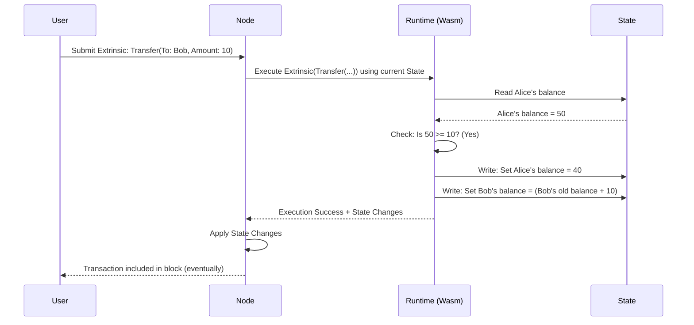

# Chapter 1: Runtime

Welcome to the Parachain tutorial! We're starting our journey by looking at one of the most fundamental concepts: the **Runtime**.

Imagine you're playing a board game. How do you know whose turn it is, how many spaces to move, or what happens when you land on a specific square? You know because of the **rulebook**. The rulebook defines everything you can do in the game and how the game state (like player positions and scores) changes.

In the world of blockchains, the **Runtime** is very similar to that rulebook.

**What is the Runtime?**

At its heart, a blockchain is a shared database (the "ledger") that keeps track of things like account balances or other data. But how does this database change? How do we ensure changes are valid? That's where the Runtime comes in.

The Runtime is the core logic of the blockchain. It defines:

1.  **The Rules:** What makes a transaction valid? (e.g., Do you have enough money to send?)
2.  **The State Transitions:** How does the blockchain's state change when a valid transaction happens? (e.g., Decrease sender's balance, increase receiver's balance).
3.  **The Features:** What specific capabilities does this blockchain have? (e.g., Transferring tokens, voting, smart contracts).

Think of the Runtime as the **"Operating System"** or the **"Rulebook"** for the blockchain. It's the brain that dictates how everything works.

**Why is it important? (Use Case: Sending Tokens)**

Let's say Alice wants to send 10 tokens to Bob on our parachain.

1.  Alice creates a request (a "transaction" or [Extrinsic](05_extrinsic_.md)) saying "Send 10 tokens from my account to Bob's account."
2.  This request is sent to the blockchain network.
3.  How does the network know if Alice *can* send 10 tokens? Does she have enough? Is Bob's account valid?
4.  The **Runtime** contains the rules! Specifically, it might have a "Balances" module (called a [FRAME Pallet](03_frame_pallet_.md)) that checks Alice's balance.
5.  If the Runtime's rules confirm the transaction is valid, it then executes the state change: subtract 10 tokens from Alice's account state and add 10 tokens to Bob's account state.

Without the Runtime, the blockchain would just be a static database with no way to update it according to agreed-upon rules.

**Key Concepts within the Runtime**

1.  **State Transition Function (STF):** This is the fancy term for the core job of the Runtime. It takes the *current state* of the blockchain and a new *input* (like Alice's transaction) and, based on its rules, calculates the *new state*. `Current State + Input => New State` (if rules pass).
2.  **Pallets:** Runtimes aren't usually built as one giant piece of code. They are modular, composed of building blocks called **Pallets** ([FRAME Pallet](03_frame_pallet_.md)). Think of pallets like apps on your smartphone's operating system. Each pallet provides specific features.
    *   `pallet-balances`: Handles token balances and transfers (like in our Alice-to-Bob example).
    *   `pallet-timestamp`: Keeps track of the current time.
    *   `pallet-sudo`: Allows a "super user" account to make privileged changes.
    Our parachain Runtime combines many such pallets to create its unique set of features and rules.
3.  **Wasm (WebAssembly):** The Runtime code is compiled into a special format called WebAssembly (Wasm). This is like a universal language that computers can understand. Why Wasm?
    *   **Portability:** The *exact same* Runtime logic can run on different computers ([Nodes](02_node_.md)) in the network, ensuring everyone agrees on the rules.
    *   **Upgradability:** Blockchains need to evolve. Because the Runtime is Wasm, the blockchain can be upgraded *without* requiring everyone to update their node software immediately. The new rules (Wasm) can be stored directly on the blockchain itself!

**How is the Runtime Defined?**

Developers define the Runtime by selecting and configuring the pallets they need. In our project, this happens primarily in the `runtime/` directory.

Let's look at a snippet from `runtime/src/lib.rs`. This is where we "construct" the Runtime by listing the pallets it includes:

```rust
// runtime/src/lib.rs (simplified)

// --snip-- lots of setup code --snip--

// Create the runtime by composing the FRAME pallets that were previously configured.
#[frame_support::runtime]
mod runtime {
	#[runtime::runtime]
	// --snip-- other attributes --snip--
	pub struct Runtime; // This defines our Runtime!

	// List the pallets included in our Runtime.
	// Each line assigns a name and an index.
	#[runtime::pallet_index(0)]
	pub type System = frame_system; // Basic system functions
	#[runtime::pallet_index(10)]
	pub type Balances = pallet_balances; // Token handling!
	#[runtime::pallet_index(11)]
	pub type TransactionPayment = pallet_transaction_payment; // Fee handling
	#[runtime::pallet_index(15)]
	pub type Sudo = pallet_sudo; // Superuser commands
	// --snip-- other pallets like Aura, Session, XCM --snip--
	#[runtime::pallet_index(50)]
	pub type TemplatePallet = pallet_parachain_template; // Our custom pallet
}

// --snip-- more code --snip--
```

This code uses a special tool (`construct_runtime!`) to weave together different pallets (`frame_system`, `pallet_balances`, `pallet_sudo`, etc.) into a single `Runtime` definition. Each pallet listed here contributes its specific rules and features to our blockchain. The dependencies for these pallets are listed in `runtime/Cargo.toml`.

**How the Runtime Executes (Under the Hood)**

So, we have this Runtime definition compiled to Wasm. How does it actually *run*?

1.  **Node Software:** A computer participating in the blockchain network runs software called a "Node" ([Node](02_node_.md)). The Node stores the blockchain's history and listens for new transactions.
2.  **Runtime Execution Environment:** The Node software contains an execution environment capable of running Wasm code. Think of it like a secure virtual machine specifically designed to run the blockchain's Runtime logic.
3.  **Block Processing:** When a Node needs to process a new block of transactions (or validate a transaction it just received):
    *   It loads the current state of the blockchain.
    *   It takes the Runtime Wasm (either built-in or fetched from the blockchain state if recently upgraded).
    *   It feeds the transaction(s) into the Runtime Wasm running inside the execution environment.
    *   The Runtime code (composed of pallets) executes: it checks rules, calculates state changes.
    *   If valid, the Node updates its local state according to the Runtime's output.

Here's a simplified view of what happens when a Node processes Alice's transfer:



The `Executive` pallet plays a key role here. It's like the conductor of an orchestra, coordinating the overall flow of execution within the Runtime for each block (e.g., setting up the block, running transactions, finalizing the block).

```rust
// runtime/src/lib.rs (simplified snippet)

/// Executive: handles dispatch to the various modules.
pub type Executive = frame_executive::Executive<
	Runtime, // Our specific Runtime definition
	Block,   // The block format
	frame_system::ChainContext<Runtime>,
	Runtime,
	AllPalletsWithSystem, // List of all included pallets
	Migrations, // Code for handling upgrades
>;
```

This `Executive` uses the pallets we defined earlier (`AllPalletsWithSystem`) to process transactions according to the rules defined in the Runtime. The detailed rules for each pallet (like how much balance is needed, who can perform certain actions) are defined in their configuration, which we'll explore more in the [Runtime Configuration](04_runtime_configuration___config__trait__.md) chapter.

**Conclusion**

The Runtime is the heart of your blockchain's logic. It's the rulebook, compiled to portable Wasm code, and built from modular pieces called pallets. It defines exactly how the blockchain state can change and what features it offers. It's the core element that makes your blockchain unique.

In the next chapter, we'll look at the software that actually *runs* this Runtime code: the [Node](02_node_.md).

---

Generated by [AI Codebase Knowledge Builder](https://github.com/The-Pocket/Tutorial-Codebase-Knowledge)