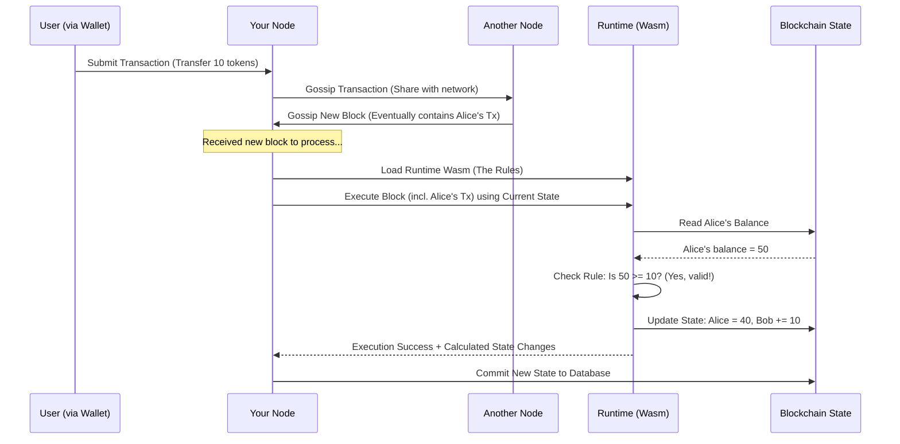

# Chapter 2: Node

In [Chapter 1: Runtime](01_runtime_.md), we learned about the "rulebook" of our blockchain – the **Runtime**. It defines all the logic, rules, and features. But a rulebook sitting on a shelf doesn't do anything by itself. You need someone or something to *read* the rulebook and *enforce* the rules during the game.

That's where the **Node** comes in!

**What is a Node?**

Think back to our board game analogy. If the Runtime is the rulebook, the **Node** is like the **game console** or the **computer server** that actually runs the game.

In blockchain terms, the Node is the **actual software application** that you run on your computer. It's the program that:

1.  **Connects** to other Nodes (called "peers") over the internet to form a network.
2.  **Downloads** the blockchain's history (the "ledger" or "state") from its peers and keeps it synchronized.
3.  **Listens** for new transactions submitted by users.
4.  **Executes** the blockchain's logic using the [Runtime](01_runtime_.md) (specifically, the Runtime's Wasm code) to check if transactions are valid according to the rules.
5.  **Updates** the blockchain state if transactions are valid.
6.  **Shares** new blocks and transactions with its peers.
7.  **(Sometimes)** Participates in creating new blocks (e.g., as a "collator" in a parachain).

Essentially, the Node is the engine that makes the blockchain *live* and operate. It's the software that downloads, runs, and enforces the rules defined by the [Runtime](01_runtime_.md). Without Nodes, there would be no network, no shared ledger, and no way to interact with the blockchain.

**Key Responsibilities of a Node**

Let's break down the main jobs of a Node:

*   **Networking:** Nodes need to find each other. They use networking protocols (like TCP/IP and libp2p) to discover peers, connect to them, and exchange messages like "Here's a new transaction I heard about!" or "Here's the latest block!".
*   **Chain Synchronization:** When a Node first starts or reconnects after being offline, it needs to catch up with the latest state of the blockchain. It asks its peers for the blocks it's missing and verifies them one by one until it's fully synced.
*   **Runtime Execution:** This is where the Node interacts with the [Runtime](01_runtime_.md). The Node software contains a special, secure environment (a Wasm executor) that can load and run the Runtime Wasm code. When processing a new block or transaction, the Node asks the Runtime: "According to your rules, is this valid? And if so, what are the state changes?".
*   **Transaction Pool:** Nodes maintain a "waiting room" for transactions they've heard about but haven't yet been included in a block. This is called the transaction pool (or mempool).
*   **Block Production (Collators/Validators):** Some nodes have special roles. In our parachain, "collator" nodes gather transactions from the pool and propose new blocks to be included in the chain, following the rules defined in the [Runtime](01_runtime_.md).
*   **RPC Server:** Nodes often provide a way for users and applications to interact with the blockchain. This is usually done through an RPC (Remote Procedure Call) interface. Your wallet application, for example, talks to a Node's RPC server to check your balance or send a transaction.

**How the Node Uses the Runtime**

The Node and the Runtime are distinct but work together closely:

*   The **Node** is the *software environment* that runs the blockchain. It handles networking, storage, and provides the Wasm execution sandbox.
*   The **Runtime** is the *Wasm blob* containing the blockchain's *logic and rules*, which runs *inside* the Node's execution environment.

Think of it like your web browser (the Node) running a web application (the Runtime, compiled to something like JavaScript/Wasm). The browser provides the environment, but the web app defines what you actually see and do.

When a Node needs to process a block, it does something like this:



The Node orchestrates the process, but the Runtime makes the decisions based on its internal rules.

**Running Your Own Node**

In our project, the Node software is compiled into an executable file. You typically find this in the `target/release/` directory after building the project, and it's often named something like `parachain-template-node`.

Running it is usually done from your computer's terminal:

```bash
# Example command to start a basic node for local testing
./target/release/parachain-template-node \
    --dev \ # Use a temporary development chain
    --tmp   # Use temporary storage (deleted on exit)
```

*   `./target/release/parachain-template-node`: This is the path to the compiled Node software.
*   `--dev`: This flag tells the node to use a predefined, simple "development" chain configuration, useful for testing. It often includes things like predefined accounts with funds.
*   `--tmp`: This tells the node to store its data (the blockchain state) in a temporary directory that gets deleted when you stop the node. Useful for clean testing!

When you run this command, the Node software starts up. You'll see log messages showing it:
*   Initializing itself.
*   Discovering and connecting to peers (if on a shared network, though `--dev` usually runs standalone).
*   Potentially starting to produce blocks (if configured as a collator/validator in the chain spec).
*   Listening for incoming transactions or RPC requests.

**Under the Hood: Node Components**

The Node software isn't one giant program but is built from several key components working together. The code for our node lives primarily in the `node/` directory.

1.  **Entry Point (`node/src/main.rs`):** Like most Rust programs, this is where execution begins. It mainly parses command-line arguments and calls the main command execution logic.

    ```rust
    // node/src/main.rs (Simplified)
    fn main() -> sc_cli::Result<()> {
        // Parse arguments and run the appropriate command
        command::run()
    }
    ```
    This tiny file just kicks things off by calling `run` from the `command.rs` file.

2.  **Command Handling (`node/src/command.rs`):** This file interprets the command-line arguments (like `--dev`, `--collator`, or specifying a chain) and decides what action to take. For starting the node, it configures and launches the node service.

    ```rust
    // node/src/command.rs (Simplified 'run' function, 'None' case)
    pub fn run() -> Result<()> {
        let cli = Cli::from_args(); // Parse arguments using Cli struct

        match &cli.subcommand {
            // -- snip -- other subcommands like build-spec, purge-chain -- snip --

            None => { // No subcommand? Start the node!
                let runner = cli.create_runner(&cli.run.normalize())?;
                // ... setup based on cli args (collator? relay chain?)...

                // This is the core function call to start the node!
                runner.run_node_until_exit(|config| async move {
                    // ... configure relay chain interface, para_id ...

                    // Call the function that builds and starts all node components
                    crate::service::start_parachain_node(
                        config, // Parachain config
                        polkadot_config, // Relay chain config
                        collator_options,
                        id, // Parachain ID
                        hwbench, // Hardware benchmark info
                    )
                    .await
                    // -- snip -- map result -- snip --
                })
            },
        }
    }
    ```
    This code checks if you provided a subcommand (like `build-spec`). If not (`None`), it prepares the configuration and calls `start_parachain_node` (from `service.rs`) to actually launch the blockchain node.

3.  **Service Setup (`node/src/service.rs`):** This is a crucial file. It wires together all the essential parts of the node: the networking layer, the database backend, the transaction pool, the Runtime executor, consensus mechanisms (like Aura for block production), the RPC endpoints, and the connection to the relay chain (if applicable). The `start_parachain_node` function orchestrates this setup.

    ```rust
    // node/src/service.rs (Simplified function signature)

    // Function to configure and start all the node's background tasks
    pub async fn start_parachain_node(
        parachain_config: Configuration, // Node's own config
        polkadot_config: Configuration, // Relay chain's config
        collator_options: CollatorOptions, // Options if running as collator
        para_id: ParaId, // The parachain's ID
        hwbench: Option<sc_sysinfo::HwBench>, // Hardware info
    ) -> sc_service::error::Result<(TaskManager, Arc<ParachainClient>)> {
        // 1. Prepare basic components (client, backend, task manager)
        let params = new_partial(&parachain_config)?;
        // ... extract client, backend, etc. from params ...

        // 2. Build Relay Chain Interface (to talk to Polkadot/Kusama)
        let (relay_chain_interface, collator_key) = build_relay_chain_interface(...).await?;

        // 3. Build Networking Layer
        let (network, _, _, sync_service) = build_network(...).await?;

        // 4. Setup Offchain Workers (if enabled)
        // ... sc_offchain::OffchainWorkers::new(...) ...

        // 5. Setup RPC Handlers
        // ... crate::rpc::create_full(...) ...

        // 6. Spawn Basic Service Tasks (RPC, basic sync)
        sc_service::spawn_tasks(...)?;

        // 7. Start Relay Chain communication tasks
        start_relay_chain_tasks(...)?;

        // 8. Start Consensus Engine (if node is a collator)
        if validator { // Is this node supposed to produce blocks?
            start_consensus(...)?; // Start Aura consensus
        }

        Ok((task_manager, client))
    }
    ```
    This function is the heart of bringing the node to life. It calls various helper functions (many provided by Substrate and Cumulus frameworks) to initialize each component (networking, consensus, RPC, etc.) and starts them as background tasks managed by the `TaskManager`. We'll explore the [Service](09_service_.md) concept in more detail later.

4.  **CLI Definition (`node/src/cli.rs`):** This defines the structure of the command-line arguments that the node accepts, using the `clap` library.

    ```rust
    // node/src/cli.rs (Simplified)
    #[derive(Debug, clap::Parser)]
    pub struct Cli {
        #[command(subcommand)]
        pub subcommand: Option<Subcommand>, // e.g., build-spec

        #[command(flatten)]
        pub run: cumulus_client_cli::RunCmd, // Common run options

        /// Relay chain arguments (passed after '--')
        #[arg(raw = true)]
        pub relay_chain_args: Vec<String>,

        // ... other args like --no-hardware-benchmarks ...
    }

    #[derive(Debug, clap::Subcommand)]
    pub enum Subcommand {
        BuildSpec(sc_cli::BuildSpecCmd), // build-spec command
        PurgeChain(cumulus_client_cli::PurgeChainCmd), // purge-chain command
        // ... other subcommands ...
    }
    ```
    This code defines what commands and flags (like `--dev` or `build-spec`) the node understands when you run it from the terminal.

**Conclusion**

The Node is the executable software application that brings a blockchain to life. It connects to peers, syncs the chain, manages transactions, and most importantly, provides the environment to execute the [Runtime](01_runtime_.md)'s logic (the Wasm rules). It's the physical manifestation of the blockchain network on a computer. The code in the `node/` directory defines how this application is built and run.

In the next chapter, we'll dive back inside the [Runtime](01_runtime_.md) to look at its fundamental building blocks: [FRAME Pallet](03_frame_pallet_.md). These are the modular components that actually define the features and rules executed by the Node.

---

Generated by [AI Codebase Knowledge Builder](https://github.com/The-Pocket/Tutorial-Codebase-Knowledge)