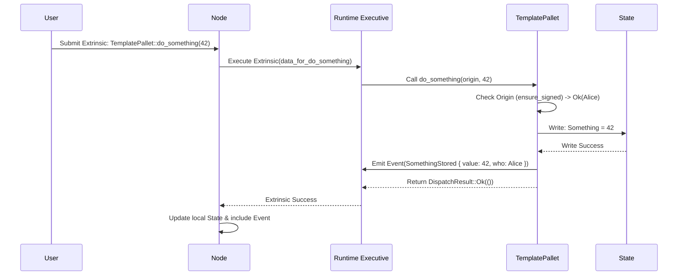

# Chapter 3: FRAME Pallet

In [Chapter 1: Runtime](01_runtime_.md), we learned that the Runtime is the "rulebook" or "operating system" of our blockchain. In [Chapter 2: Node](02_node_.md), we saw that the Node is the software that actually *runs* this rulebook.

Now, let's think about how we *build* that rulebook (the Runtime). Writing all the rules for a complex blockchain as one giant program would be incredibly difficult to manage, update, and understand. Imagine trying to update the camera functionality on your smartphone if the entire operating system was just one enormous file! It would be a nightmare.

This is where **FRAME Pallets** come in.

**The Problem: Building Complex Runtime Logic**

How do we organize the logic of our blockchain's [Runtime](01_runtime_.md)? We need a way to break down complex features (like handling money, managing user accounts, allowing voting, or adding custom game logic) into manageable, reusable pieces.

**The Solution: FRAME Pallets - Modular Building Blocks**

**FRAME** stands for **Framework for Runtime Aggregation of Modularized Entities**. That's a mouthful! Let's break it down:

*   **Framework:** A set of tools and libraries (provided by Polkadot SDK/Substrate) to help you build.
*   **Runtime Aggregation:** Putting things together to create the Runtime.
*   **Modularized Entities:** Independent pieces, like building blocks.

So, FRAME gives us a way to build our Runtime using **Pallets**.

Think of pallets like **apps** or **plugins** for your blockchain's operating system (the [Runtime](01_runtime_.md)). Each pallet provides a specific set of features or handles a particular piece of business logic.

**Analogy: Smartphone Apps**

*   Your smartphone's **Operating System** (like iOS or Android) is like the **Runtime**. It provides the basic foundation.
*   The **Apps** you install (Camera, Maps, Music Player, Games) are like **Pallets**. Each app adds specific functionality.

You combine different apps to make your phone useful for *you*. Similarly, blockchain developers combine different pallets to create the specific features needed for their blockchain.

**Common Examples of Pallets:**

*   `pallet-balances`: Handles creating accounts and transferring tokens (like our Alice sending tokens to Bob example from Chapter 1).
*   `pallet-timestamp`: Keeps track of the current time on the blockchain.
*   `pallet-sudo`: Provides a "superuser" account that can perform privileged actions (useful for initial setup or emergencies).
*   `pallet-parachain-template` (in our project): A simple placeholder pallet showing the basic structure, which we can customize to add *our* unique features.

**How Pallets are Combined:**

In the `runtime/src/lib.rs` file, we use a special Rust macro called `construct_runtime!` to list all the pallets we want to include in our Runtime. This macro takes these individual modules and weaves them together into the final Runtime logic.

```rust
// runtime/src/lib.rs (Simplified view from Chapter 1)

// Create the runtime by composing the FRAME pallets...
#[frame_support::runtime]
mod runtime {
	#[runtime::runtime]
	// --snip--
	pub struct Runtime; // Our Runtime definition

	// List the pallets included in our Runtime.
	#[runtime::pallet_index(0)]
	pub type System = frame_system; // Basic system functions
	#[runtime::pallet_index(10)]
	pub type Balances = pallet_balances; // <<< Token handling pallet!
	#[runtime::pallet_index(15)]
	pub type Sudo = pallet_sudo; // <<< Superuser pallet!
	// --snip-- other pallets --snip--
	#[runtime::pallet_index(50)]
	pub type TemplatePallet = pallet_parachain_template; // <<< Our custom pallet!
}

// --snip-- more code --snip--
```

This code tells the framework: "Build my Runtime using the System pallet, the Balances pallet, the Sudo pallet, ..., and the TemplatePallet."

**Inside a Pallet: Key Components (`pallet-template`)**

Let's look at the structure of a simple pallet. We'll use `pallet-parachain-template` found in `pallets/template/src/lib.rs` as our example. This pallet is designed as a starting point for developers.

```rust
// pallets/template/src/lib.rs (Simplified Structure)

#![cfg_attr(not(feature = "std"), no_std)] // Standard Rust setup

pub use pallet::*; // Make pallet items easily accessible

// The main pallet definition using the `#[frame::pallet]` macro
#[frame::pallet]
pub mod pallet {
    use frame::prelude::*; // Import necessary FRAME items

    // 1. Configuration Trait (`Config`)
    #[pallet::config]
    pub trait Config: frame_system::Config {
        // Types and parameters the pallet needs from the runtime
        type RuntimeEvent: From<Event<Self>> + IsType</*...*/RuntimeEvent>;
        type WeightInfo: crate::weights::WeightInfo;
    }

    // 2. Pallet Struct (Holds no data itself usually)
    #[pallet::pallet]
    pub struct Pallet<T>(_);

    // 3. Storage Items
    #[pallet::storage]
    pub type Something<T: Config> = StorageValue<_, u32>; // Stores a number

    // 4. Events
    #[pallet::event]
    #[pallet::generate_deposit(pub(super) fn deposit_event)]
    pub enum Event<T: Config> {
        // Event definition: Something was stored
        SomethingStored { value: u32, who: T::AccountId },
    }

    // 5. Errors
    #[pallet::error]
    pub enum Error<T> {
        // Error definition: Something went wrong
        StorageOverflow,
    }

    // 6. Hooks (Optional lifecycle functions)
    #[pallet::hooks]
    impl<T: Config> Hooks<BlockNumberFor<T>> for Pallet<T> { /* ... */ }

    // 7. Dispatchable Calls (Extrinsics)
    #[pallet::call]
    impl<T: Config> Pallet<T> {
        // Function users can call to store a value
        #[pallet::call_index(0)] // Unique index for this call
        #[pallet::weight(T::WeightInfo::do_something())] // Associated cost
        pub fn do_something(origin: OriginFor<T>, value: u32) -> DispatchResult {
            let who = ensure_signed(origin)?; // Check caller is signed
            Something::<T>::put(value); // Store the value
            Self::deposit_event(Event::SomethingStored { value, who }); // Emit event
            Ok(()) // Success
        }
        // ... other functions like cause_error ...
    }
}
```

Let's break down these numbered sections marked by `#[pallet::...]` macros:

1.  **`#[pallet::config]` (`Config` trait):** This is like the pallet's settings panel or requirements list. It defines placeholder types (like `RuntimeEvent`, `WeightInfo`) and parameters that the specific [Runtime](01_runtime_.md) (which uses this pallet) must provide. This makes pallets reusable because they don't hardcode runtime specifics. We'll dive deep into this in the next chapter: [Runtime Configuration (`Config` trait)](04_runtime_configuration___config__trait__.md).
2.  **`#[pallet::pallet]`:** This declares the main pallet structure. It's usually a simple placeholder.
3.  **`#[pallet::storage]`:** This is where the pallet defines the data it needs to store on the blockchain. Think of it as the pallet's own little database tables. In our example, `Something` is a storage item that holds a single unsigned 32-bit integer (`u32`).
4.  **`#[pallet::event]`:** Events are how the pallet signals that something important has happened. When the `do_something` function successfully stores a value, it emits the `SomethingStored` event, including the value and who stored it. Applications or users can listen for these events.
5.  **`#[pallet::error]`:** This defines the custom error types that the pallet's functions might return if something goes wrong. For example, if an operation caused a number to exceed its maximum value.
6.  **`#[pallet::hooks]`:** These are special functions that the Runtime calls automatically during a block's lifecycle, like `on_initialize` (before processing transactions) or `on_finalize` (after processing transactions). Useful for recurring tasks or setup/cleanup.
7.  **`#[pallet::call]`:** These are the functions that users can actually trigger by submitting transactions (called [Extrinsics](05_extrinsic_.md) in Substrate). `do_something` is a dispatchable call. Notice it takes an `origin` (who called it) and a `value`, checks the origin, updates storage (`Something::put`), emits an event, and returns a `DispatchResult` (Ok or Error). The `#[pallet::weight]` macro is crucial for estimating the computational cost, which we'll cover in the [Weights](06_weights_.md) chapter.

**How a Pallet Call is Handled (Under the Hood)**

Let's imagine a user wants to call the `do_something` function in our `TemplatePallet` with the value `42`.

1.  **User Submits Extrinsic:** The user creates a transaction ([Extrinsic](05_extrinsic_.md)) that essentially says "I want to call `TemplatePallet::do_something` with the value `42`" and signs it.
2.  **Node Receives:** A [Node](02_node_.md) in the network receives this extrinsic.
3.  **Node Executes Runtime:** The Node uses the [Runtime](01_runtime_.md) Wasm code to process the extrinsic.
4.  **Executive Dispatches:** Inside the Runtime, a special pallet called the `Executive` (mentioned in Chapter 1) acts as a traffic controller. It looks at the extrinsic and sees it's meant for `TemplatePallet` (it knows this based on the pallet index defined in `construct_runtime!`) and specifically for the `do_something` function (based on the `#[pallet::call_index(0)]`).
5.  **Pallet Function Called:** The `Executive` calls the `do_something(origin, 42)` function inside the `TemplatePallet` code.
6.  **Pallet Logic Runs:**
    *   `ensure_signed(origin)?`: Checks if the extrinsic was properly signed by a valid account. Let's say Alice signed it. `who` becomes Alice's `AccountId`.
    *   `Something::<T>::put(42);`: The pallet writes the value `42` into its `Something` storage item on the blockchain state.
    *   `Self::deposit_event(...)`: The pallet emits the `SomethingStored` event with `value: 42` and `who: Alice`.
    *   `Ok(())`: The function signals success back to the `Executive`.
7.  **Execution Finishes:** The `Executive` sees the successful result and finishes processing the extrinsic. The Node updates its state database to reflect the storage change ( `Something` now holds `42`) and includes the event in the block data.

Here's a simplified diagram of that flow:



**Conclusion**

FRAME Pallets are the fundamental building blocks for creating the logic of your blockchain's [Runtime](01_runtime_.md). They allow you to encapsulate specific features (like balances, timestamping, or your own custom logic) into modular, reusable, and maintainable pieces of code. Each pallet typically defines its own storage, events, errors, and callable functions ([Extrinsics](05_extrinsic_.md)). By combining different pallets using `construct_runtime!`, you assemble the unique functionality of your blockchain.

But how does a pallet know about specific types or configurations defined in the overall Runtime, like what the `AccountId` format is, or what the `BlockNumber` type is? Pallets achieve this adaptability through their `Config` trait. In the next chapter, we'll explore exactly how this works in [Runtime Configuration (`Config` trait)](04_runtime_configuration___config__trait__.md).

---

Generated by [AI Codebase Knowledge Builder](https://github.com/The-Pocket/Tutorial-Codebase-Knowledge)