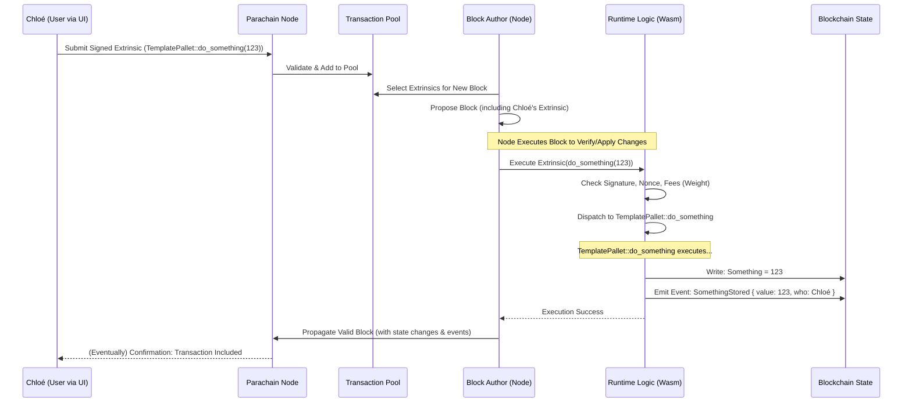

# Chapter 5: Extrinsic

In the [previous chapter](04_runtime_configuration___config__trait__.md), we saw how the `Config` trait acts like a settings panel, allowing the runtime to configure individual [FRAME Pallet](03_frame_pallet_.md)s with specific types and values like `Balance` or `AccountId`. We now have these pallets configured and ready to go inside our [Runtime](01_runtime_.md).

But how do we actually *tell* the blockchain to *do* something using these pallets? For example, how does Alice tell the `pallet-balances` to transfer tokens, or how does a user tell our `pallet-parachain-template` to execute its `do_something` function?

We need a way to send instructions *from the outside world* into the blockchain's [Runtime](01_runtime_.md) logic. This is the job of an **Extrinsic**.

**Motivation: Sending a Command to the Blockchain**

Imagine our blockchain is running. It has the `pallet-parachain-template` included in its [Runtime](01_runtime_.md). Remember this pallet has a function:

```rust
// Simplified from pallets/template/src/lib.rs
#[pallet::call]
impl<T: Config> Pallet<T> {
    #[pallet::call_index(0)]
    #[pallet::weight(/*...*/)]
    pub fn do_something(origin: OriginFor<T>, value: u32) -> DispatchResult {
        let who = ensure_signed(origin)?; // Check who sent this
        Something::<T>::put(value);       // Store the value
        Self::deposit_event(Event::SomethingStored { value, who }); // Announce it
        Ok(())
    }
}
```

A user, let's call her Chloé, wants to call this `do_something` function with the value `123`. How does she package this request, prove it's really her making the request, and send it to the blockchain network so it can eventually be executed?

**What is an Extrinsic?**

An **Extrinsic** is the mechanism for getting information *from outside* the blockchain *into* the blockchain, where it can trigger actions defined in the [Runtime](01_runtime_.md).

Think of it like sending a **command** or an **instruction** to the blockchain.

*   **Analogy 1: Email Server:** Sending an email is like sending an extrinsic. You compose the email (the instruction), specify the recipient (the pallet/function), add your signature (cryptographic signature), and send it over the network. The server (blockchain [Node](02_node_.md)) receives it, verifies it, and processes it (executes the [Runtime](01_runtime_.md) logic).
*   **Analogy 2: Command Line:** Typing a command like `git commit -m "My message"` into your terminal is like sending an extrinsic. You specify the action (`commit`), the parameters (`-m "My message"`), and implicitly, your identity (as the logged-in user). The system executes the command.

**Key Characteristics:**

1.  **Originates Outside:** Extrinsics come from outside the blockchain state itself (e.g., a user's wallet application).
2.  **Included in Blocks:** Valid extrinsics are gathered by block producers ([Nodes](02_node_.md) acting as Collators in our case) and included in the blocks they create.
3.  **Triggers State Changes:** When a block containing an extrinsic is processed, the [Runtime](01_runtime_.md) executes the logic associated with that extrinsic, potentially changing the blockchain's state (like updating storage or balances).
4.  **Defines Interactions:** The available extrinsics determine *how* users and external systems can interact with the blockchain.

**Types of Extrinsics (Simplified View):**

While there are nuances, for beginners, it's helpful to think about:

*   **Signed Extrinsics:** These are the most common type. They are "signed" cryptographically by a user's private key, proving that the owner of a specific account authorized the action. Our example of Chloé calling `do_something(123)` would be a signed extrinsic. The `ensure_signed(origin)?` check in the `do_something` function verifies this signature. This is essential for actions that cost fees or require specific permissions (like transferring funds).
*   **Unsigned Extrinsics & Inherents:** These are special cases. Unsigned extrinsics don't have a signature proving origin (used carefully for things like reporting offline workers). Inherents are pieces of information inserted into a block directly by the block author (like a timestamp), not submitted by external users. We'll focus mainly on *signed extrinsics* as they represent typical user interactions.

**How are Extrinsics Defined? By Pallets!**

Where do the available "commands" or "instructions" come from? They are defined within [FRAME Pallet](03_frame_pallet_.md)s!

Specifically, functions marked with the `#[pallet::call]` attribute inside a pallet define the dispatchable calls that can be triggered by extrinsics.

```rust
// pallets/template/src/lib.rs
#[pallet::call] // This marks the section defining dispatchable calls (Extrinsics)
impl<T: Config> Pallet<T> {
    // This function defines the "do_something" extrinsic
    #[pallet::call_index(0)] // A unique ID for this call within the pallet
    #[pallet::weight(T::WeightInfo::do_something())] // Cost estimation
    pub fn do_something(origin: OriginFor<T>, value: u32) -> DispatchResult {
        // ... logic ...
    }

    // This function defines the "cause_error" extrinsic
    #[pallet::call_index(1)]
    #[pallet::weight(T::WeightInfo::cause_error())] // Cost estimation
    pub fn cause_error(origin: OriginFor<T>) -> DispatchResultWithPostInfo {
        // ... logic ...
    }
}
```

So, by including `pallet-parachain-template` in our runtime, we automatically make the `do_something` and `cause_error` actions available to users via extrinsics. Similarly, `pallet-balances` provides extrinsics like `transfer_allow_death`.

The `RuntimeCall` enum, automatically generated in `runtime/src/lib.rs` by the `construct_runtime!` macro, aggregates *all* these `#[pallet::call]` functions from *all* included pallets into one big list of possible commands the runtime understands.

```rust
// Conceptual view of what construct_runtime! generates in runtime/src/lib.rs
enum RuntimeCall {
    // Calls from frame_system pallet
    System(frame_system::Call<Runtime>),
    // Calls from pallet_balances
    Balances(pallet_balances::Call<Runtime>), // e.g., Balances(transfer_allow_death { dest, value })
    // Calls from our template pallet
    TemplatePallet(pallet_parachain_template::Call<Runtime>), // e.g., TemplatePallet(do_something { value })
    // ... calls from all other pallets ...
}
```

**How Chloé Sends Her Extrinsic**

1.  **Use an Interface:** Chloé probably won't write Rust code. She'll use a wallet or a web application (like Polkadot-JS Apps) that connects to a parachain [Node](02_node_.md).
2.  **Select the Action:** In the interface, she selects the pallet (`templatePallet`) and the call (`doSomething`).
3.  **Provide Arguments:** She enters the required argument (`value: 123`).
4.  **Sign the Transaction:** The interface constructs the raw extrinsic data (identifying the pallet, the call, and the arguments). It then asks Chloé to "sign" this data using her private key. This doesn't reveal her key but produces a unique cryptographic signature.
    *   **Analogy:** Signing a check authorizes the payment without giving away your bank account password.
    *   **Nonce:** The extrinsic also includes a 'nonce' (a counter) to prevent the same signed transaction from being replayed.
5.  **Submit:** The interface sends the signed extrinsic (the command + signature + nonce etc.) to the connected [Node](02_node_.md).

**The Lifecycle of an Extrinsic**

What happens after Chloé clicks "Submit"?



1.  **Submission:** Chloé's UI sends the signed extrinsic to a [Node](02_node_.md).
2.  **Validation & Pool:** The Node does some initial checks (e.g., is the signature valid? Is the format correct?) and, if okay, places it in its **Transaction Pool** (a waiting area).
3.  **Block Inclusion:** When a [Node](02_node_.md) acts as a Collator (block author), it selects transactions from the pool to include in the next block it's trying to build. It prioritizes transactions, often based on fees (related to [Weights](06_weights_.md)).
4.  **Block Production:** The Collator creates a block containing Chloé's extrinsic (and others).
5.  **Execution:** As part of processing or validating the block, the [Node](02_node_.md)'s execution environment runs the [Runtime](01_runtime_.md) Wasm.
    *   The `Executive` pallet coordinates execution.
    *   It takes Chloé's extrinsic from the block data.
    *   It performs crucial checks: signature verification (is it really from Chloé?), nonce check (has this exact transaction been processed before?), and ensures Chloé can pay the transaction fee (calculated based on the extrinsic's [Weights](06_weights_.md)).
    *   If checks pass, the `Executive` looks at the call data (identifying `TemplatePallet` and `do_something`) and **dispatches** the call to the actual `TemplatePallet::do_something` function within the [Runtime](01_runtime_.md).
6.  **Pallet Logic Runs:** The `do_something` function executes:
    *   `ensure_signed` confirms the origin.
    *   `Something::<T>::put(123)` updates the value in the blockchain's state storage.
    *   `deposit_event` records that the action happened.
7.  **Confirmation:** The block is finalized and propagated through the network. Chloé's UI eventually gets confirmation that her transaction was successful and included in a block. The state change (`Something` is now `123`) is permanent.

**Under the Hood: Code References**

*   **Extrinsic Definition:** `pallets/template/src/lib.rs` within the `#[pallet::call]` block.
*   **Extrinsic Aggregation:** `runtime/src/lib.rs` where `construct_runtime!` builds the `RuntimeCall` enum, implicitly defining all possible extrinsic calls.
*   **Extrinsic Type:** `runtime/src/lib.rs` defines the overall structure of an extrinsic on this chain:
    ```rust
    // runtime/src/lib.rs
    /// Unchecked extrinsic type as expected by this runtime.
    pub type UncheckedExtrinsic =
    	generic::UncheckedExtrinsic<Address, RuntimeCall, Signature, TxExtension>;

    /// The extension to the basic transaction logic.
    // Includes checks for nonce, weight, paying fees, etc.
    pub type TxExtension = /* ... lots of system checks ... */;
    ```
    This shows an `UncheckedExtrinsic` is composed of an `Address` (optional, for unsigned), the `RuntimeCall` (the actual command), the `Signature`, and `TxExtension` (extra data like nonce, tip, fee payment info).
*   **Execution Entry Point:** The `Executive` pallet (`frame-executive`) is responsible for iterating through extrinsics in a block and calling `apply_extrinsic`.
*   **Dispatch Logic:** Inside `Executive::apply_extrinsic`, checks are performed, and then the appropriate function within the `RuntimeCall` enum is called, routing the execution to the correct pallet.

**Conclusion**

Extrinsics are the bridge between the outside world and the blockchain's [Runtime](01_runtime_.md) logic. They are signed commands, originating from users or applications, that instruct the blockchain to perform actions defined by `#[pallet::call]` functions within [FRAME Pallet](03_frame_pallet_.md)s. When included in a block and executed, they trigger state transitions according to the runtime's rules.

But how does the network know how much "work" an extrinsic like `do_something` requires? How are transaction fees calculated to prevent spam and prioritize important operations? This relates to the concept of **Weights**, which we will explore in the [next chapter](06_weights_.md).

---

Generated by [AI Codebase Knowledge Builder](https://github.com/The-Pocket/Tutorial-Codebase-Knowledge)