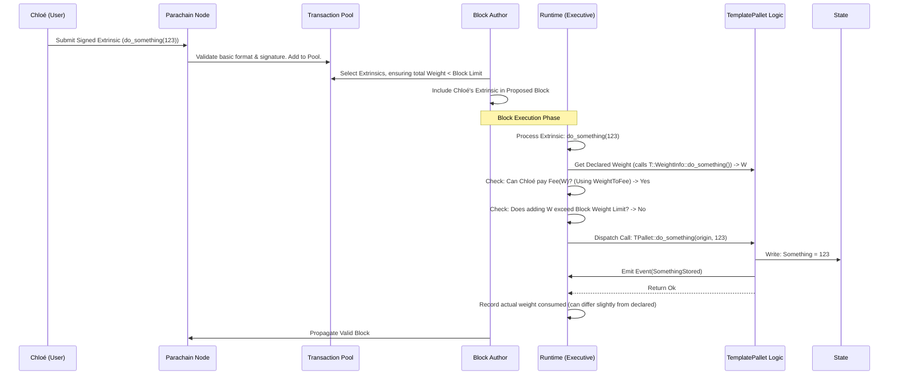

# Chapter 6: Weights

In the [previous chapter](05_extrinsic_.md), we learned about [Extrinsic](05_extrinsic_.md)s – the way users send commands like "transfer tokens" or "call `do_something`" to the blockchain. These commands trigger actions defined in [FRAME Pallet](03_frame_pallet_.md)s within the [Runtime](01_runtime_.md).

But this brings up some important questions:

*   What stops someone from sending an [Extrinsic](05_extrinsic_.md) that takes a *very* long time to compute, slowing down the whole network?
*   How can the network ensure that blocks are produced at a regular pace?
*   How should users be charged for using the blockchain's resources? Should a simple token transfer cost the same as a complex computation?

The answer to these questions lies in a concept called **Weights**.

**Motivation: Limited Resources and Fair Pricing**

Imagine a shared computer that many people use. If one person starts a huge, complex calculation that takes hours, nobody else can use the computer effectively during that time. Blockchains face a similar problem. The computers ([Nodes](02_node_.md)) running the network have limited computational power and time to process transactions within a block.

We need a system to:

1.  **Measure Resource Usage:** Quantify how much computational effort (time, database operations) an [Extrinsic](05_extrinsic_.md) requires.
2.  **Limit Resource Usage:** Prevent any single block from taking too long to execute, ensuring the blockchain progresses smoothly.
3.  **Price Resource Usage:** Charge users fairly based on the resources their actions consume.

This system is called **Weights**.

**What are Weights? Resource Metering for Blockchains**

Think of **Weight** as a way to **measure the cost** of doing things on the blockchain. It's like "resource metering." Every operation, especially executing an [Extrinsic](05_extrinsic_.md), has an associated Weight value that represents how much work it takes.

*   **Analogy: Postage Stamps:** Imagine sending packages. A heavier package requires more stamps (more cost). Similarly, a computationally "heavier" extrinsic has a higher Weight and usually incurs a higher fee.
*   **Analogy: Gas (Other Blockchains):** If you're familiar with Ethereum, Weight is similar in purpose to "Gas." It's a unit used to quantify computational cost.

**Components of Weight:**

In FRAME / Polkadot SDK, Weight typically has two main components (though often combined into a single value):

1.  **`ref_time` (Execution Time):** Measures how long an operation takes to execute. It's not measured in seconds on your specific computer, but in abstract, standardized units (like picoseconds on reference hardware) to ensure consistency across the network.
2.  **`proof_size` (Database Access / Proof Size):** Measures the amount of data that needs to be read from or written to the blockchain's state database during the operation. This is important because accessing storage takes time and contributes to the size of the proof needed to validate the block, especially in parachains.

**Purpose of Weights:**

*   **Limit Block Execution Time:** Each block has a maximum total Weight it can contain. When a [Node](02_node_.md) (acting as a Collator) builds a block, it can only include extrinsics whose total Weight fits within this limit. This prevents blocks from becoming too computationally expensive to process, keeping the network stable and predictable.
*   **Calculate Transaction Fees:** The Weight of an [Extrinsic](05_extrinsic_.md) is a primary input for calculating the transaction fee. Heavier extrinsics consume more network resources, so they generally cost more. This creates an economic incentive for users and developers to write efficient code.
*   **Prevent Spam/Denial-of-Service (DoS):** By making computationally expensive operations costly, Weights help prevent malicious actors from overwhelming the network with resource-heavy transactions.

**How Weights are Used**

1.  **Block Limits:** The [Runtime](01_runtime_.md) defines a maximum total Weight per block (often called `BlockWeights`). This limit ensures that block processing time stays within acceptable bounds. You can see this configured in the runtime:

    ```rust
    // runtime/src/configs/mod.rs (Simplified)
    use frame_system::limits::BlockWeights;
    use frame_support::parameter_types;
    use super::{NORMAL_DISPATCH_RATIO, MAXIMUM_BLOCK_WEIGHT, BlockExecutionWeight, ExtrinsicBaseWeight};

    parameter_types! {
        pub RuntimeBlockWeights: BlockWeights = BlockWeights::builder()
            .base_block(BlockExecutionWeight::get()) // Base weight of an empty block
            .for_class(DispatchClass::all(), |weights| {
                weights.base_extrinsic = ExtrinsicBaseWeight::get(); // Base weight per extrinsic
            })
            .for_class(DispatchClass::Normal, |weights| {
                // Set max total weight for normal user extrinsics
                weights.max_total = Some(NORMAL_DISPATCH_RATIO * MAXIMUM_BLOCK_WEIGHT);
            })
            // ... configuration for other dispatch classes ...
            .build_or_panic();
    }

    // And this is passed to the System pallet's configuration
    impl frame_system::Config for Runtime {
        // --snip--
        type BlockWeights = RuntimeBlockWeights; // Assign the limits here
        // --snip--
    }
    ```

    This code defines the overall capacity of a block in terms of Weight. Collators must respect this limit when choosing extrinsics from the transaction pool.

2.  **Fee Calculation (`pallet-transaction-payment`):** The Weight of an extrinsic is used to calculate the fee. The runtime configures a `WeightToFee` mechanism, often a simple multiplier, to convert Weight units into the chain's native currency (e.g., Balance).

    ```rust
    // runtime/src/configs/mod.rs (Simplified)
    use super::{Balance, WeightToFee};

    // Configure the transaction payment pallet
    impl pallet_transaction_payment::Config for Runtime {
        type RuntimeEvent = RuntimeEvent;
        type OnChargeTransaction = pallet_transaction_payment::FungibleAdapter<Balances, ()>;
        // This tells the pallet how to convert Weight to a Fee (Balance)
        type WeightToFee = WeightToFee;
        // ... other config ...
    }
    ```

    Before an extrinsic is even executed, the runtime checks if the sender has enough funds to pay the fee calculated based on its *declared* weight.

3.  **Extrinsic Weight Declaration:** How does the runtime know the weight of an extrinsic *before* executing it? The extrinsic must declare its weight. This is done using the `#[pallet::weight(...)]` attribute on the dispatchable call definition in the pallet.

    ```rust
    // pallets/template/src/lib.rs
    use crate::weights::WeightInfo; // Import the WeightInfo trait

    #[frame::pallet]
    pub mod pallet {
        // --snip-- Config requires WeightInfo --snip--
        #[pallet::config]
        pub trait Config: frame_system::Config {
            type WeightInfo: crate::weights::WeightInfo; // Require weight info
            // --snip--
        }

        #[pallet::pallet]
        pub struct Pallet<T>(_);

        // --snip-- storage, events, errors --snip--

        #[pallet::call]
        impl<T: Config> Pallet<T> {
            #[pallet::call_index(0)]
            // THIS is where the weight is declared for the `do_something` extrinsic
            #[pallet::weight(T::WeightInfo::do_something())]
            pub fn do_something(origin: OriginFor<T>, value: u32) -> DispatchResult {
                let who = ensure_signed(origin)?;
                // ... pallet logic ...
                Ok(())
            }

            #[pallet::call_index(1)]
            // And the weight for `cause_error`
            #[pallet::weight(T::WeightInfo::cause_error())]
            pub fn cause_error(origin: OriginFor<T>) -> DispatchResultWithPostInfo {
                 // ... pallet logic ...
                 Ok(().into())
            }
        }
    }
    ```

    This code tells the runtime: "To find the weight for the `do_something` function, call the `do_something()` function defined in the `WeightInfo` type provided by the runtime's configuration ([Chapter 4](04_runtime_configuration___config__trait__.md))."

**Determining Weights: Benchmarking**

Okay, but where do the `WeightInfo` functions (like `do_something()`) come from? We can't just guess the computational cost. We need to measure it accurately.

This is done through **Benchmarking**.

1.  **Process:** Developers use a special tool provided by the Polkadot SDK (`benchmark pallet` command). This tool runs each dispatchable function (like `do_something`) many times, with different inputs, on standardized "reference hardware".
2.  **Measurement:** It carefully measures the execution time (`ref_time`) and database operations (`proof_size`) for each run.
3.  **Analysis:** It analyzes these measurements to create mathematical formulas (or simple constant values if the cost doesn't vary much) that *estimate* the Weight based on the extrinsic's input parameters.
4.  **Output (`weights.rs`):** The results are compiled into a Rust file, typically named `weights.rs`, within the pallet's source code directory (e.g., `pallets/template/src/weights.rs`). This file defines a `WeightInfo` trait and implements it with the benchmarked formulas or values.

```rust
// pallets/template/src/weights.rs (Simplified Output from Benchmarking)

use frame::{deps::frame_support::weights::{constants::RocksDbWeight, Weight}, prelude::*};
use core::marker::PhantomData;

/// Weight functions needed for pallet_template. (Generated by benchmarking)
pub trait WeightInfo {
    fn do_something() -> Weight;
    fn cause_error() -> Weight;
}

/// Weights using the Substrate node's recommended hardware. (Generated)
pub struct SubstrateWeight<T>(PhantomData<T>);
impl<T: frame_system::Config> WeightInfo for SubstrateWeight<T> {
    // Weight function for `do_something` based on benchmarks
    fn do_something() -> Weight {
        // Benchmark determined cost: ~9 million picoseconds + 1 DB write
        Weight::from_parts(9_000_000, 0) // Base ref_time and proof_size
            .saturating_add(T::DbWeight::get().writes(1_u64)) // Add cost for 1 DB write
    }

    // Weight function for `cause_error` based on benchmarks
    fn cause_error() -> Weight {
        // Benchmark determined cost: ~6 million ps + reads/writes + proof size estimate
        Weight::from_parts(6_000_000, 1489) // Base ref_time and proof_size
            .saturating_add(T::DbWeight::get().reads(1_u64))  // Add cost for 1 DB read
            .saturating_add(T::DbWeight::get().writes(1_u64)) // Add cost for 1 DB write
    }
}

// Fallback implementation for tests (can use RocksDbWeight directly)
impl WeightInfo for () {
	fn do_something() -> Weight {
		Weight::from_parts(9_000_000, 0)
			.saturating_add(RocksDbWeight::get().writes(1_u64))
	}
	fn cause_error() -> Weight {
		Weight::from_parts(6_000_000, 1489)
			.saturating_add(RocksDbWeight::get().reads(1_u64))
			.saturating_add(RocksDbWeight::get().writes(1_u64))
	}
}
```

This generated code provides the concrete weight estimations. The runtime then connects this implementation to the pallet via the `Config` trait:

```rust
// runtime/src/configs/mod.rs

// Configure the pallet template
impl pallet_parachain_template::Config for Runtime {
	type RuntimeEvent = RuntimeEvent;
	// Tell the template pallet to use the benchmarked weights
	type WeightInfo = pallet_parachain_template::weights::SubstrateWeight<Runtime>;
}
```

Now, when an extrinsic for `TemplatePallet::do_something` arrives, the runtime knows to call `pallet_parachain_template::weights::SubstrateWeight::<Runtime>::do_something()` to get its estimated Weight.

**Internal Flow: How Weights are Checked**

Let's trace how Weights play a role when Chloé submits her `do_something(123)` extrinsic ([Chapter 5](05_extrinsic_.md)).



1.  **Submission & Pool:** Chloé submits the extrinsic. The node does initial validation and adds it to the Transaction Pool.
2.  **Block Building:** The Collator selects extrinsics. It checks the *declared weight* of each extrinsic (using `WeightInfo`) and ensures the total weight doesn't exceed the `BlockWeights` limit.
3.  **Execution - Pre-Checks:** When the block is executed (by the collator proposing it, or other nodes verifying it), the [Runtime](01_runtime_.md)'s `Executive` pallet processes each extrinsic.
    *   It gets the declared Weight (`W`) using the `WeightInfo` provided via the pallet's `Config`.
    *   It checks if Chloé has enough funds to cover the fee calculated from `W` (using `WeightToFee`).
    *   It performs other standard checks (signature, nonce).
    *   It double-checks that adding `W` to the current block's weight doesn't exceed the limit.
4.  **Dispatch:** If all checks pass, the `Executive` dispatches the call to the actual `TemplatePallet::do_something` function.
5.  **Execution & Post-Info:** The pallet logic runs. Afterwards, the runtime notes the *actual* weight consumed (which might be slightly different from the pre-calculated estimate, though often the pre-calculated one is charged).

**Conclusion**

Weights are a crucial mechanism in FRAME-based blockchains for **resource metering**. They measure the computational cost of operations, primarily extrinsics. By defining weights for dispatchable calls (usually through **benchmarking**) and setting limits on the total weight per block, the network ensures stability, prevents abuse, and provides a basis for fair transaction fees. Weights ensure that the limited computational resources of the blockchain are used effectively and priced appropriately.

In the next chapter, we'll look at the [Chain Specification (Chain Spec)](07_chain_specification__chain_spec__.md), which defines the *initial* state and configuration of a blockchain, including things like genesis accounts, initial code, and potentially parameters related to fees or weights.

---

Generated by [AI Codebase Knowledge Builder](https://github.com/The-Pocket/Tutorial-Codebase-Knowledge)