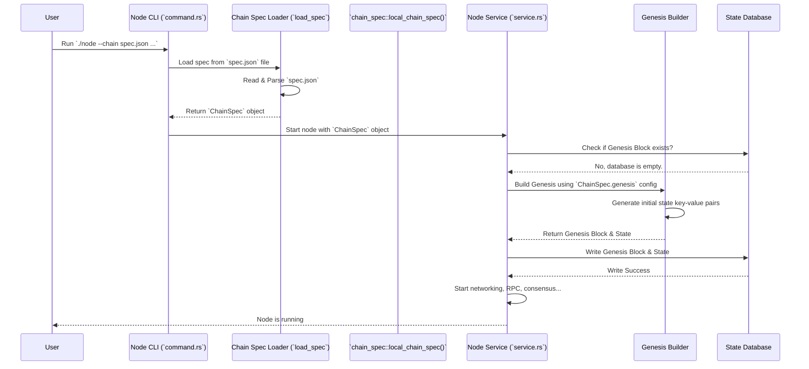

# Chapter 7: Chain Specification (Chain Spec)

In the [previous chapter](06_weights_.md), we learned about [Weights](06_weights_.md) – how the network measures the cost of transactions and limits resource usage to keep things running smoothly. Weights manage the blockchain *during* its operation. But how does a blockchain even *start*? What defines its initial state, its very first block, and its core rules?

Imagine you want to launch a completely new blockchain network, maybe just for testing on your local computer. Where do you begin? You need a "starting configuration" or an "initial setup script". This is where the **Chain Specification**, often shortened to **Chain Spec**, comes in.

**Motivation: Starting a New Blockchain**

Let's say we want to create a brand-new test version of our parachain. Before anyone can use it, we need to define:

*   Who gets some initial tokens to start testing?
*   What is the very first version of the blockchain's rulebook (the [Runtime](01_runtime_.md) code)?
*   If it's a parachain, which Relay Chain (like Polkadot or Kusama, or a test version) should it try to connect to?
*   Who are the initial trusted computers ([Nodes](02_node_.md)) allowed to produce blocks (known as "collators" in parachains)?

The Chain Spec is the place where all these initial conditions are defined.

**What is a Chain Spec? The Blockchain's Blueprint**

A **Chain Specification (Chain Spec)** is a configuration file or data structure that defines the **initial state** (called the **genesis state**) of a blockchain network. It's like the blueprint for constructing the very first block, known as the "genesis block".

Think of it like:

*   **A Building Blueprint:** It details the foundation, initial structure, and layout before construction even begins.
*   **A Board Game Setup:** It tells you how to set up the board, where each player starts, and how many resources everyone gets at the beginning.
*   **An OS Installer Configuration:** It specifies initial settings like language, timezone, default users, and disk partitions before the operating system is installed.

The Chain Spec contains crucial information needed to bootstrap a network:

1.  **Genesis State:** This defines the initial values stored on the blockchain. It configures the starting state for various [FRAME Pallet](03_frame_pallet_.md)s. Examples include:
    *   Initial account balances (`pallet-balances`).
    *   The "superuser" account (`pallet-sudo`).
    *   The initial set of authorities/collators (`pallet-collator-selection`, `pallet-session`).
    *   The parachain's unique ID (`pallet-parachain-info`).
2.  **Runtime Code:** It includes the initial WebAssembly (Wasm) blob of the [Runtime](01_runtime_.md). This is the rulebook the chain starts with.
3.  **Chain Identity:** Information like the network's name (e.g., "Development", "Local Testnet"), its unique ID (e.g., "dev", "local_testnet"), and type (e.g., Development, Local, Testnet, Mainnet).
4.  **Networking Info:** Often includes addresses of initial "bootnodes" (nodes that new nodes can connect to initially to discover peers) and a unique protocol ID to distinguish this chain's network traffic.
5.  **Metadata:** Other helpful info, like the symbol for the native token (e.g., "UNIT") and its decimal places.

**Why is it Important?**

*   **Launching New Chains:** You absolutely need a Chain Spec to create the genesis block, the starting point of any new blockchain.
*   **Joining Existing Chains:** When a new [Node](02_node_.md) wants to join an existing network, it needs the Chain Spec (or information derived from it) to know the initial configuration and genesis state. This allows it to correctly verify the chain's history and sync up.
*   **Consistency:** The Chain Spec ensures that all nodes starting the chain begin with the *exact same* state and rules. If nodes used different Chain Specs, they would effectively be starting different, incompatible blockchains!

**How is a Chain Spec Defined? (`node/src/chain_spec.rs`)**

In our project, the code that defines different Chain Specs lives in `node/src/chain_spec.rs`. Let's look at a simplified version of how a "local testnet" spec might be defined:

```rust
// Simplified from node/src/chain_spec.rs

use parachain_template_runtime as runtime; // Our runtime code
use sc_service::{ChainType, GenericChainSpec};
// -- snip other imports --

// Define parachain-specific extensions (Para ID, Relay Chain)
#[derive(/*...*/)]
pub struct Extensions {
    pub relay_chain: String,
    pub para_id: u32,
}
// -- snip impl Extensions --

/// Function to create the ChainSpec for a local testnet
pub fn local_chain_spec() -> GenericChainSpec<Extensions> {
    // Define properties like token symbol and decimals
    let mut properties = sc_chain_spec::Properties::new();
    properties.insert("tokenSymbol".into(), "UNIT".into());
    properties.insert("tokenDecimals".into(), 12.into());
    // -- snip ss58Format --

    #[allow(deprecated)] // Ignore warning for preset name usage
    GenericChainSpec::builder(
        // 1. Provide the initial Runtime Wasm code
        runtime::WASM_BINARY.expect("WASM binary not built!"),
        // 2. Provide the parachain extensions
        Extensions {
            relay_chain: "rococo-local".into(), // Connect to local Rococo relay
            para_id: runtime::PARACHAIN_ID,     // Use Para ID from runtime
        },
    )
    .with_name("Local Testnet") // 3. Set chain name
    .with_id("local_testnet")   // 4. Set chain ID
    .with_chain_type(ChainType::Local) // 5. Set chain type
    // 6. Specify the PRESET for genesis configuration
    .with_genesis_config_preset_name(sc_chain_spec::LOCAL_TESTNET_RUNTIME_PRESET)
    // -- snip protocol ID --
    .with_properties(properties) // 7. Add metadata properties
    .build() // 8. Build the ChainSpec object
}
```

Let's break down the key parts of `local_chain_spec()`:

1.  `runtime::WASM_BINARY`: This provides the initial [Runtime](01_runtime_.md) code (compiled to Wasm) that the chain will start with.
2.  `Extensions`: Sets parachain-specific details like the `para_id` (our chain's unique ID) and the `relay_chain` it should connect to.
3.  `.with_name()`: Gives the chain a human-readable name.
4.  `.with_id()`: Gives the chain a unique machine-readable ID.
5.  `.with_chain_type()`: Specifies if it's a development chain, local testnet, etc.
6.  `.with_genesis_config_preset_name()`: This is important! Instead of defining the entire genesis state right here, it references a predefined *preset* (like `LOCAL_TESTNET_RUNTIME_PRESET`). We'll see where these presets come from next.
7.  `.with_properties()`: Adds metadata like the token symbol ("UNIT") and decimals (12).
8.  `.build()`: Constructs and returns the final `ChainSpec` object.

**Genesis State Configuration (`runtime/src/genesis_config_presets.rs`)**

The presets used in `with_genesis_config_preset_name` are defined in `runtime/src/genesis_config_presets.rs`. They provide the actual initial storage values for the pallets.

Here's a highly simplified look at how a preset might configure genesis:

```rust
// Highly simplified from runtime/src/genesis_config_presets.rs

use crate::{
    AccountId, BalancesConfig, CollatorSelectionConfig, /* SudoConfig, */ RuntimeGenesisConfig,
    // -- snip other imports --
};
use sp_keyring::Sr25519Keyring; // For predefined dev accounts like Alice, Bob
use frame_support::build_struct_json_patch; // Helper to build JSON config
use serde_json::Value;
use cumulus_primitives_core::ParaId;

// Constants
pub const PARACHAIN_ID: u32 = 1000; // Our example Para ID

/// Helper function to generate genesis configuration JSON
fn testnet_genesis(
    invulnerables: Vec<(AccountId, /* AuraId */)>, // Initial collators
    endowed_accounts: Vec<AccountId>,         // Accounts with initial funds
    root: AccountId,                          // Sudo key account
    id: ParaId,                               // Parachain ID
) -> Value {
    build_struct_json_patch!(RuntimeGenesisConfig {
        // Configure pallet-balances
        balances: BalancesConfig {
            balances: endowed_accounts
                .iter()
                .cloned()
                .map(|k| (k, 1u128 << 60)) // Give each endowed account a LOT of tokens
                .collect::<Vec<_>>(),
        },
        // Configure pallet-parachain-info
        parachain_info: parachain_info::GenesisConfig { parachain_id: id },
        // Configure pallet-collator-selection
        collator_selection: CollatorSelectionConfig {
            invulnerables: invulnerables.iter().cloned().map(|(acc, _)| acc).collect(),
            // -- snip candidacy_bond --
        },
        // Configure pallet-sudo
        sudo: sudo::GenesisConfig { key: Some(root) }, // Set Alice as the sudo key
        // -- snip configuration for session, xcm etc. --
    })
}

// Function defining the 'local testnet' preset configuration
fn local_testnet_genesis() -> Value {
    testnet_genesis(
        // Set Alice and Bob as initial collators
        vec![
            (Sr25519Keyring::Alice.to_account_id(), /* Alice AuraId */),
            (Sr25519Keyring::Bob.to_account_id(), /* Bob AuraId */),
        ],
        // Give initial funds to Alice, Bob, Charlie, Dave, Eve, Ferdie
        Sr25519Keyring::well_known().map(|k| k.to_account_id()).collect(),
        // Set Alice as the Sudo (superuser) account
        Sr25519Keyring::Alice.to_account_id(),
        PARACHAIN_ID.into(), // Use our Para ID
    )
}

// Function used by the node to get the preset JSON
pub fn get_preset(id: &str) -> Option<Vec<u8>> {
    let patch = match id {
        "local_testnet" => local_testnet_genesis(),
        // -- snip dev preset --
        _ => return None,
    };
    // Convert the JSON Value to bytes
    Some(serde_json::to_string(&patch).unwrap().into_bytes())
}
```

This code:
*   Defines helper functions (`testnet_genesis`, `local_testnet_genesis`) that specify *who* gets initial funds (`BalancesConfig`), *who* the initial collators are (`CollatorSelectionConfig`), *who* the sudo user is (`SudoConfig`), and the `parachain_id`.
*   Uses well-known development accounts like `Alice` and `Bob` for convenience.
*   Uses `build_struct_json_patch!` to create a JSON structure representing this initial state. This JSON data gets embedded within the `ChainSpec` object.
*   The `get_preset` function is called internally by the node when using `.with_genesis_config_preset_name()` to fetch this JSON configuration.

Essentially, this file translates high-level settings (like "Alice is sudo", "Bob has funds") into the specific data structures needed to initialize the storage of each relevant pallet in the genesis block.

**Using the Chain Spec**

So we have functions that *define* a Chain Spec in code. How do we use it?

1.  **Generate the Raw Spec File (JSON):**
    You often need the Chain Spec as a standalone file, usually in JSON format. You can generate this using a command provided by the [Node](02_node_.md) software itself: the `build-spec` subcommand.

    ```bash
    # Go to your project's root directory first!

    # Command to generate the 'local' chain spec JSON
    ./target/release/parachain-template-node build-spec --chain local > local_chain_spec.json
    ```
    This command executes the `local_chain_spec()` function we saw earlier, takes the resulting `ChainSpec` object (including the genesis JSON generated by the preset), and serializes the whole thing into a file named `local_chain_spec.json`.

    The resulting JSON file (`local_chain_spec.json`) contains all the details: name, ID, Wasm code (usually hex-encoded), bootnodes, properties, and the crucial `genesis` section detailing the initial storage values.

2.  **Launch a Node with the Spec:**
    Once you have the JSON file, you can start a node using that specific configuration.

    ```bash
    # Command to start a node using the generated spec file
    # We also make it a collator for local testing
    ./target/release/parachain-template-node \
        --chain ./local_chain_spec.json \
        --tmp \
        --collator \
        --force-authoring \
        -- \
        --chain rococo-local.json # Assuming you have the relay chain spec too
    ```
    *   `--chain ./local_chain_spec.json`: Tells the node to use the configuration from this file instead of a built-in preset like `--dev` or `--chain local`.
    *   `--tmp`: Uses temporary storage (cleared when the node stops).
    *   `--collator`: Runs the node in collator mode (block production).
    *   `--force-authoring`: Useful for local testing, ensures block production.
    *   The arguments after `--` are passed to the embedded relay chain node.

    When the node starts with a Chain Spec file:
    *   If it's the very first node for this chain, it reads the `genesis` section of the JSON and constructs the very first block (block #0).
    *   If it's joining an existing network or restarting, it uses the Chain Spec to verify its local state and ensure it's compatible with the network it's trying to join.

**Internal Flow: Node Startup with Chain Spec**

Here's a simplified view of what happens when you start the *first* node using a chain spec file:



1.  The user starts the node, providing the path to the Chain Spec JSON file.
2.  The Node's command-line interface (`command.rs`) parses the arguments.
3.  It uses a loader (`load_spec` or similar logic for file paths) to read and parse the JSON file into a `ChainSpec` object.
4.  This object is passed to the main node service (`service.rs`).
5.  The service checks its database. Since this is the first launch, the database is empty (no genesis block).
6.  The service uses the `genesis` configuration within the `ChainSpec` object to build the initial state (setting storage values for balances, sudo, collators, etc.).
7.  This initial state is written to the node's database as the genesis block (block #0).
8.  The node then proceeds with its normal operations (connecting to peers, listening for transactions, producing blocks if it's a collator).

**Conclusion**

The Chain Specification (Chain Spec) is the essential **starting blueprint** for any FRAME-based blockchain. It defines the initial state (genesis), the starting rules ([Runtime](01_runtime_.md) Wasm), and other key parameters needed to launch a new network or for nodes to correctly join an existing one. Defined typically in `node/src/chain_spec.rs` and often exported to a JSON file using the `build-spec` command, it's the foundation upon which the entire blockchain is built.

Now that we have a running chain, initialized according to its Chain Spec, how does the external world (like a user interface or another program) communicate *directly* with the Runtime to query its state or call specific functions in a customized way? That's where the [Runtime API](08_runtime_api_.md) comes in, which we'll explore in the next chapter.

---

Generated by [AI Codebase Knowledge Builder](https://github.com/The-Pocket/Tutorial-Codebase-Knowledge)