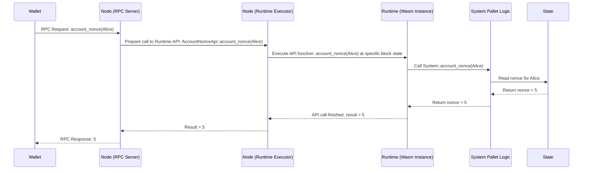

# Chapter 8: Runtime API

In the [previous chapter](07_chain_specification__chain_spec__.md), we explored the [Chain Specification (Chain Spec)](07_chain_specification__chain_spec__.md), which acts as the blueprint defining the *initial* state of our blockchain. It sets everything up before the chain even starts producing blocks.

But once the blockchain is running, how do external applications (like wallets, block explorers, or even the [Node](02_node_.md) software itself) ask the [Runtime](01_runtime_.md) questions or get specific information *without* sending a transaction ([Extrinsic](05_extrinsic_.md))?

**Motivation: Asking the Runtime Questions**

Imagine you're using a wallet application. Before you send some tokens, your wallet needs to know your current **nonce** (a counter for your transactions, explained briefly in [Chapter 5](05_extrinsic_.md)). This nonce must be included in the transaction to make it valid and prevent replays.

How does your wallet get this nonce from the blockchain?

*   Option 1: Send an [Extrinsic](05_extrinsic_.md) asking "What's my nonce?". This seems inefficient. It would require creating a transaction, paying fees, waiting for it to be included in a block, just to read a simple value.
*   Option 2: The wallet needs a direct way to *query* the [Runtime](01_runtime_.md)'s state for the nonce.

Similarly, how does the wallet estimate the transaction fee *before* you submit the transaction? It needs to ask the [Runtime](01_runtime_.md) to calculate the fee based on the transaction details.

This need for a direct query and interaction mechanism, outside the normal flow of extrinsics in blocks, is solved by the **Runtime API**.

**What is a Runtime API? The Runtime's Direct Interface**

A **Runtime API** is a set of functions that are:

1.  **Defined** inside the [Runtime](01_runtime_.md) code.
2.  **Exposed** specifically for the outer [Node](02_node_.md) software (and potentially external clients via the Node's RPC server) to call directly.
3.  Used to **query** runtime state or **execute specific logic** (like validating a transaction or calculating fees) *without* needing to include something in a block or perform a full state transition.

Think of it like this:

*   **Analogy 1: Website API:** Many websites have an API (Application Programming Interface) that allows other programs to fetch data (like weather information or stock prices) or perform actions directly, separate from just browsing the website pages. The Runtime API is like an API *for the Runtime itself*.
*   **Analogy 2: Car Dashboard:** Your car's dashboard shows you information (speed, fuel level) directly from the car's systems without you needing to perform a full engine diagnostic. The Runtime API provides a similar direct view into the Runtime's state and functions.
*   **Analogy 3: Control Panel:** It's a dedicated "control panel" or "query interface" allowing the [Node](02_node_.md) and external tools to interact with the [Runtime](01_runtime_.md)'s logic and data efficiently.

**Key Differences from Extrinsics:**

*   **Purpose:** [Extrinsics](05_extrinsic_.md) are primarily for *changing* the blockchain state and are recorded permanently in blocks. Runtime APIs are often for *reading* state or performing helper computations/validations needed by the Node or external tools.
*   **Inclusion:** Extrinsics are included in blocks. Runtime API calls are usually handled directly by a [Node](02_node_.md) when it receives a request (often via RPC).
*   **State Changes:** Runtime API calls typically *don't* change the blockchain's state (though some specialized ones used internally by the node might). They usually operate on a specific, existing block's state.

**Common Uses:**

*   **Querying State:** Getting account balances, nonces, or other storage values.
*   **Transaction Validation:** Checking if a transaction received by the [Node](02_node_.md) is potentially valid before adding it to the transaction pool (`TaggedTransactionQueue::validate_transaction`).
*   **Fee Estimation:** Calculating the likely fee for an extrinsic (`TransactionPaymentApi::query_info`).
*   **Metadata:** Providing information about the Runtime's capabilities, pallets, extrinsics, events, and storage items (`Metadata::metadata`). This is crucial for UIs and tools to understand how to interact with the chain.
*   **Block Building Helpers:** Providing functions needed by the [Node](02_node_.md) when constructing new blocks (`BlockBuilder::apply_extrinsic`, `BlockBuilder::finalize_block`).

**How Runtime APIs are Defined (`runtime/src/apis.rs`)**

Runtime APIs are defined in the runtime code, typically within a dedicated file like `runtime/src/apis.rs`. The core mechanism uses a special macro called `impl_runtime_apis!`.

Inside this macro, we implement standard API traits (like `AccountNonceApi`, `TransactionPaymentApi`, `Metadata`) for our `Runtime`. Each implementation specifies how the [Runtime](01_runtime_.md) should handle calls to that specific API function.

Let's look at a simplified snippet focusing on getting the account nonce:

```rust
// Simplified from runtime/src/apis.rs

// -- snip -- imports like AccountId, Balance, Block, System etc. -- snip --
use sp_api::impl_runtime_apis;
use frame_system_rpc_runtime_api::AccountNonceApi; // Import the standard API trait

impl_runtime_apis! {
    // Implement the AccountNonceApi trait for our Runtime
    impl AccountNonceApi<Block, AccountId, Nonce> for Runtime {
        // This function will be called when the Node needs an account's nonce
        fn account_nonce(account: AccountId) -> Nonce {
            // It simply calls the 'account_nonce' function from our System pallet
            System::account_nonce(account)
        }
    }

    // -- snip -- implementations for other APIs like Metadata, BlockBuilder etc. -- snip --

    // Implement the TransactionPaymentApi trait (for fee estimation)
    impl pallet_transaction_payment_rpc_runtime_api::TransactionPaymentApi<Block, Balance>
        for Runtime
    {
        // Function to query dispatch info (includes weight, class, partial fee)
        fn query_info(
            uxt: <Block as BlockT>::Extrinsic, // The extrinsic to estimate for
            len: u32, // The encoded length of the extrinsic
        ) -> pallet_transaction_payment_rpc_runtime_api::RuntimeDispatchInfo<Balance>
        {
            // Calls the function from the TransactionPayment pallet
            TransactionPayment::query_info(uxt, len)
        }
        // -- snip -- other fee-related API functions like query_fee_details -- snip --
    }
}
```

*   `impl_runtime_apis! { ... }`: This macro wraps all the API implementations.
*   `impl AccountNonceApi<...> for Runtime { ... }`: This block specifically implements the `AccountNonceApi` trait (defined by Substrate framework) for our `Runtime`.
*   `fn account_nonce(account: AccountId) -> Nonce`: This is the actual API function definition. When the [Node](02_node_.md) calls this Runtime API function...
*   `System::account_nonce(account)`: ...it executes this code inside the runtime, which delegates the work to the `account_nonce` function provided by the `frame-system` [FRAME Pallet](03_frame_pallet_.md). This function reads the current nonce for the given `account` from the blockchain state.
*   Similarly, the `TransactionPaymentApi` implementation delegates fee calculation calls to the `pallet-transaction-payment`.

**How the Nonce Use Case is Solved:**

1.  **Wallet Request:** Your wallet wants Alice's nonce. It sends an RPC request like `account_nonce(Alice's AccountId)` to a connected parachain [Node](02_node_.md).
2.  **Node Receives:** The Node's RPC server gets the request.
3.  **Node Calls Runtime API:** The Node recognizes this RPC call corresponds to the `AccountNonceApi::account_nonce` Runtime API function. It invokes this function within the runtime's Wasm environment, passing `Alice's AccountId`.
4.  **Runtime Executes:** Inside the Wasm, the `account_nonce` function defined in `impl_runtime_apis!` runs. It calls `System::account_nonce(Alice's AccountId)`.
5.  **State Query:** The `System` pallet reads Alice's current nonce from the blockchain state storage (at the specific block the query is targeted at, usually the latest finalized block).
6.  **Runtime Returns:** The nonce value is returned from the Wasm environment back to the Node.
7.  **Node Responds:** The Node's RPC server sends the nonce value back to the wallet.
8.  **Wallet Uses Nonce:** The wallet now has the correct nonce to construct Alice's next transaction.

All of this happened without creating an [Extrinsic](05_extrinsic_.md) or waiting for a block!

**Internal Implementation: How the Node Calls the Runtime API**

Let's visualize the flow when a wallet asks for the nonce:



1.  The Wallet sends an RPC request.
2.  The Node's RPC Server handles the incoming request.
3.  It figures out which Runtime API function needs to be called (`AccountNonceApi::account_nonce`).
4.  The Node's Runtime Executor loads the [Runtime](01_runtime_.md) Wasm and calls the specific API function inside the secure Wasm environment, providing access to the state of a particular block.
5.  The Wasm code (our `impl_runtime_apis!` block) executes, calling the relevant pallet logic (`System::account_nonce`).
6.  The pallet logic reads the required data from the State database.
7.  The result is passed back through the layers until the RPC server sends the response to the Wallet.

**Making APIs Available via RPC (`node/src/rpc.rs`)**

How does the Node know how to map an incoming RPC request (like `"account_nonce"`) to the correct Runtime API call? This is set up in the Node's RPC configuration, typically in `node/src/rpc.rs`.

```rust
// Simplified from node/src/rpc.rs

// -- snip -- imports -- snip --
use std::sync::Arc;
use parachain_template_runtime::{AccountId, Balance, Block, Nonce}; // Runtime types
use sc_rpc::SubscriptionTaskExecutor;
use sc_transaction_pool_api::TransactionPool;
use sp_api::ProvideRuntimeApi; // Trait for accessing Runtime APIs
use sp_blockchain::{Error as BlockChainError, HeaderBackend, HeaderMetadata};
// -- snip -- more imports -- snip --

/// Full client dependencies needed for RPC setup.
pub struct FullDeps<C, P> {
    pub client: Arc<C>, // Client provides access to blockchain & runtime APIs
    pub pool: Arc<P>,   // Transaction pool
    // -- snip -- other deps like SubscriptionTaskExecutor -- snip --
}

/// Instantiate all RPC extensions.
pub fn create_full<C, P>(
    deps: FullDeps<C, P>,
    // -- snip -- other args -- snip --
) -> Result<jsonrpsee::RpcModule<()>, Box<dyn std::error::Error + Send + Sync>>
where
    // Constraints showing the Client must be able to provide the Runtime APIs
    C: ProvideRuntimeApi<Block> + HeaderBackend<Block> + /* ... */ + 'static,
    // Specify which APIs the Runtime must implement
    C::Api: substrate_frame_rpc_system::AccountNonceApi<Block, AccountId, Nonce>,
    C::Api: pallet_transaction_payment_rpc::TransactionPaymentRuntimeApi<Block, Balance>,
    // -- snip -- other API constraints like BlockBuilder -- snip --
    P: TransactionPool + /* ... */ + 'static,
{
    // Import the RPC modules that bridge RPC calls to Runtime API calls
    use substrate_frame_rpc_system::{System, SystemApiServer};
    use pallet_transaction_payment_rpc::{TransactionPayment, TransactionPaymentApiServer};

    let mut module = jsonrpsee::RpcModule::new(());
    let FullDeps { client, pool, /* ... */ } = deps;

    // Merge the System RPC module (provides things like account_nonce)
    // It uses the 'client' to call the actual Runtime API functions.
    module.merge(System::new(client.clone(), pool, /* ... */).into_rpc())?;

    // Merge the TransactionPayment RPC module (provides fee estimation etc.)
    module.merge(TransactionPayment::new(client.clone()).into_rpc())?;

    // -- snip -- merge other RPC modules if needed -- snip --

    Ok(module)
}
```

*   `FullDeps { client, ... }`: The `client` object is crucial. It represents the Node's connection to the blockchain backend and, importantly, the ability to execute calls *within* the Runtime Wasm (`ProvideRuntimeApi`).
*   `C::Api: AccountNonceApi<...>`: This constraint ensures that the [Runtime](01_runtime_.md) associated with the `client` actually *implements* the required `AccountNonceApi`.
*   `System::new(client, ...).into_rpc()`: This line creates the RPC handler for system-related calls (like `account_nonce`). It takes the `client` so that when an RPC call comes in, it can use the `client` to invoke the corresponding function (`AccountNonceApi::account_nonce`) in the Runtime API.
*   `module.merge(...)`: This adds the RPC methods (like `account_nonce`, `payment_queryInfo`) to the list of methods the Node's RPC server will understand.

This setup connects the external RPC request name (e.g., `"account_nonce"`) to the internal Runtime API function call (`AccountNonceApi::account_nonce`).

**Conclusion**

The Runtime API is a vital interface that allows the blockchain's [Node](02_node_.md) and external applications to interact directly with the [Runtime](01_runtime_.md)'s logic and state. It's essential for querying information (like nonces, balances, metadata), validating transactions, estimating fees, and enabling many other interactions that don't require creating a full block-based state change via an [Extrinsic](05_extrinsic_.md). Defined using `impl_runtime_apis!` in the runtime and exposed via the Node's RPC server, it provides an efficient "control panel" for the blockchain's core logic.

But how are all these Node components – the RPC server, the Runtime API execution, the networking, the database, the connection to the Relay Chain – actually wired together and managed? This coordination is handled by the Node's **Service**, which we'll explore in the [next chapter](09_service_.md).

---

Generated by [AI Codebase Knowledge Builder](https://github.com/The-Pocket/Tutorial-Codebase-Knowledge)