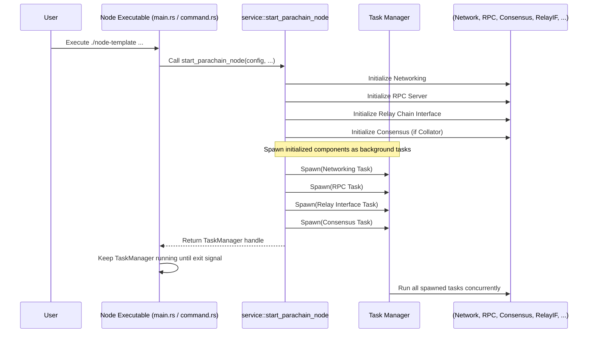

# Chapter 9: Service

In [Chapter 8: Runtime API](08_runtime_api_.md), we saw how external applications and the [Node](02_node_.md) itself can directly interact with the [Runtime](01_runtime_.md) logic using a special interface. We've now discussed many core pieces: the [Runtime](01_runtime_.md) (rules), the [Node](02_node_.md) (software environment), [Pallet](03_frame_pallet_.md)s (features), [Extrinsic](05_extrinsic_.md)s (commands), [Chain Spec](07_chain_specification__chain_spec__.md) (initial state), and the [Runtime API](08_runtime_api_.md) (direct queries).

But what actually brings all these pieces together *inside* the [Node](02_node_.md) software? How are the networking connections managed, the transaction pool operated, the consensus engine run, and the connection to the Relay Chain maintained? We need a central coordinator.

**Motivation: Orchestrating the Node's Machinery**

Imagine building a complex machine like a car. You have the engine ([Runtime](01_runtime_.md)), the chassis ([Node](02_node_.md) structure), the fuel tank (transaction pool), the steering wheel (RPC interface), the wheels (networking), and maybe even a connection to a central traffic control system (Relay Chain interface).

Just having these parts isn't enough. You need a system that connects them all, starts them in the right order, and ensures they work together seamlessly. This is the job of the **Service** in our parachain node.

**What is a Service? The Node's Engine Room**

The **Service** is a core component within the [Node](02_node_.md) software that acts as the main **orchestrator**. It's responsible for setting up, configuring, connecting, and running all the essential background processes and components needed for the blockchain node to function.

Think of the Service as the **"Engine Room"** or the **"Control Center"** of the [Node](02_node_.md). It manages the essential machinery:

1.  **Networking:** Establishes connections with peer nodes (other parachain nodes and potentially relay chain nodes) using protocols like libp2p.
2.  **Transaction Pool:** Manages the queue of incoming [Extrinsic](05_extrinsic_.md)s waiting to be included in blocks.
3.  **Block Import Queue:** Handles the process of receiving, verifying, and importing blocks into the local chain state.
4.  **Consensus Engine:** Runs the block production logic (like Aura for collators in our parachain) if the node is configured as an authority (collator).
5.  **Relay Chain Interface:** Manages the communication link with the Relay Chain (e.g., Polkadot, Kusama, or a testnet like Rococo), sending proofs-of-validity (PoVs) and receiving updates.
6.  **RPC Server:** Sets up the endpoints (like HTTP and WebSocket) that allow users and applications to interact with the node via the [Runtime API](08_runtime_api_.md).
7.  **Database Backend:** Provides access to the underlying database where the blockchain state is stored.
8.  **Runtime Execution Environment:** Configures and manages the environment (the Wasm executor) where the [Runtime](01_runtime_.md) code actually runs.

Essentially, the Service wires everything together and keeps it running.

**How the Service is Set Up (`node/src/service.rs`)**

The primary logic for configuring and starting the Service lives in the `node/src/service.rs` file. A key function here is often called something like `start_parachain_node` (as seen in [Chapter 2: Node](02_node_.md)). This function takes the node's configuration and orchestrates the setup process step-by-step.

Let's look at a *highly simplified* conceptual overview of what `start_parachain_node` does:

```rust
// Simplified Concept from node/src/service.rs

// Function to configure and start all the node's background tasks
pub async fn start_parachain_node(
    parachain_config: Configuration, // Node's own config
    polkadot_config: Configuration, // Relay chain's config
    collator_options: CollatorOptions, // Options if running as collator
    para_id: ParaId, // The parachain's ID
    // ... other args like hwbench ...
) -> Result<(TaskManager, Arc<ParachainClient>)> { // Returns TaskManager & Client

    // 1. Prepare basic components (client, backend, task manager)
    // Creates essential building blocks like the database connection (backend),
    // the interface for interacting with the runtime (client), and the
    // task manager to run background processes.
    let params = new_partial(&parachain_config)?;
    let client = params.client.clone();
    let backend = params.backend.clone();
    let mut task_manager = params.task_manager;
    // ... other components from params ...

    // 2. Build Relay Chain Interface (Connect to Polkadot/Kusama)
    // Sets up the connection to the specified Relay Chain.
    let (relay_chain_interface, collator_key) = build_relay_chain_interface(
        polkadot_config, &parachain_config, /* ... */
    ).await?;

    // 3. Build Networking Layer
    // Initializes the P2P networking, allowing the node to find and
    // communicate with other nodes.
    let (network, _, _, sync_service) = build_network(BuildNetworkParams {
        parachain_config: &parachain_config, client: client.clone(), /* ... */
    }).await?;

    // 4. Setup RPC Handlers (HTTP, WebSocket)
    // Configures the RPC server to handle incoming requests for Runtime API calls.
    let rpc_builder = Box::new(move |_| { /* setup RPC calls using client */ });

    // 5. Spawn Basic Service Tasks
    // Starts core background processes like networking, transaction handling, and RPC.
    sc_service::spawn_tasks(sc_service::SpawnTasksParams {
        rpc_builder, client: client.clone(), network, task_manager: &mut task_manager, /* ... */
    })?;

    // 6. Start Relay Chain communication tasks
    // Starts the processes that continuously interact with the Relay Chain.
    start_relay_chain_tasks(StartRelayChainTasksParams {
        client: client.clone(), relay_chain_interface: relay_chain_interface.clone(), /* ... */
    })?;

    // 7. Start Consensus Engine (if collator)
    // If this node is supposed to produce blocks (is an authority/collator)...
    let validator = parachain_config.role.is_authority();
    if validator {
        // ...start the consensus mechanism (e.g., Aura for block collation).
        start_consensus(
            client.clone(), backend, /* ... */, relay_chain_interface, collator_key, /* ... */
        )?;
    }

    // 8. Return the TaskManager and Client
    // The TaskManager keeps all spawned background tasks running.
    // The Client allows interaction with the running node.
    Ok((task_manager, client))
}
```

**Explanation:**

*   **Step 1-4:** The function first initializes individual components by calling helper functions (often provided by Substrate and Cumulus libraries like `sc_service`, `cumulus_client_service`). These helpers set up the database connection (`backend`), the runtime interface (`client`), the connection to the Relay Chain (`relay_chain_interface`), the P2P network (`network`), and the RPC request handlers (`rpc_builder`).
*   **Step 5-6:** Crucially, it then uses `sc_service::spawn_tasks` and `start_relay_chain_tasks` to launch these components as background processes managed by the `TaskManager`. The `TaskManager` ensures these different parts run concurrently without blocking each other.
*   **Step 7:** If the configuration indicates this node should be a collator (`validator` is true), it calls another function (`start_consensus`) to start the block production logic (Aura in this case).
*   **Step 8:** Finally, it returns the `TaskManager` (which holds references to all running tasks) and the `client` (which can be used to interact with the node).

The Service code acts like a master script, calling the necessary functions to build each part and then telling the `TaskManager` to start them all running.

**The Task Manager: Juggling Background Processes**

A key part of the Service is the `TaskManager`. Modern blockchain nodes need to do many things at once: listen for network messages, sync blocks, process transactions, handle RPC requests, potentially produce blocks, and communicate with the Relay Chain.

The `TaskManager` is responsible for managing these concurrent operations (often called "tasks" or "futures" in asynchronous programming). It allows the Service to launch each component (like networking or consensus) as an independent task that runs in the background without stopping the others.

**How the Service is Launched (`node/src/command.rs`)**

We saw how the Service is defined in `service.rs`. But how does the node *start* this service when you run the executable from your terminal? This connection happens in `node/src/command.rs`.

When you run `./target/release/parachain-template-node` without a specific subcommand (like `build-spec`), the code in `command.rs` typically executes the path that starts the node.

```rust
// Simplified from node/src/command.rs (`run` function, `None` case)

pub fn run() -> Result<()> {
    let cli = Cli::from_args(); // Parse command-line arguments

    match &cli.subcommand {
        // -- snip -- other subcommands like build-spec -- snip --

        None => { // No subcommand provided? Start the node!
            let runner = cli.create_runner(&cli.run.normalize())?;
            let collator_options = cli.run.collator_options();

            // Use the runner to configure and start the node asynchronously
            runner.run_node_until_exit(|config| async move {
                // ... setup relay chain config, para_id, hwbench ...

                // === This is the key call! ===
                // It invokes the function in service.rs to set up and
                // start all the node components.
                crate::service::start_parachain_node(
                    config, // Parachain config from command line/defaults
                    polkadot_config, // Relay chain config
                    collator_options,
                    id, // Parachain ID
                    hwbench,
                )
                .await
                // Return the TaskManager to keep tasks running
                .map(|r| r.0) // Extract the TaskManager from the result
                // -- snip -- error handling -- snip --
            })
        },
    }
}
```

This code shows that when you just run the node command, it eventually calls `crate::service::start_parachain_node(...)` inside `runner.run_node_until_exit`. This function (from `service.rs`) then does all the work of initializing and starting the different components (networking, consensus, RPC, etc.) managed by the `TaskManager`. The `run_node_until_exit` function ensures these tasks keep running until the node is shut down.

**Simplified Startup Flow Diagram**



This diagram illustrates how running the node executable triggers the `start_parachain_node` function in the Service layer. The Service initializes all necessary components and then uses the `TaskManager` to launch them as concurrent background tasks, effectively bringing the node to life.

**Conclusion**

The **Service** is the central orchestrator within the [Node](02_node_.md) software. It's not a single piece of logic but rather the configuration and setup code (primarily in `node/src/service.rs`) that initializes, connects, and starts all the essential components like networking, consensus, transaction pooling, RPC, and the relay chain interface. Using a `TaskManager`, it ensures these different parts run concurrently, allowing the parachain node to operate correctly and participate in the broader Polkadot network. It's the glue that holds the operational side of the node together.

Now that we understand how the node is built, run, and connected, we can explore one of the most powerful features of the Polkadot ecosystem: communication *between* chains. In the [next chapter](10_xcm__cross_consensus_messaging_.md), we'll dive into **XCM (Cross-Consensus Messaging)**.

---

Generated by [AI Codebase Knowledge Builder](https://github.com/The-Pocket/Tutorial-Codebase-Knowledge)