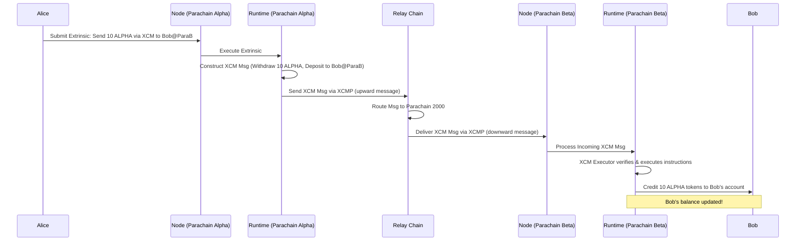

# Chapter 10: XCM (Cross-Consensus Messaging)

Welcome to the final chapter of our core concepts tutorial! In the [previous chapter](09_service_.md), we saw how the [Node](02_node_.md)'s **Service** layer acts as the orchestrator, bringing together networking, consensus, RPC, and the connection to the Relay Chain. Our parachain node is now running, connected, and participating in the network.

But the true power of the Polkadot ecosystem lies in the ability of different blockchains – the Relay Chain and various parachains – to communicate and interact with each other. How can a user on Parachain A send tokens to a user on Parachain B? How can one chain trigger an action on another?

**Motivation: Talking Between Blockchains**

Imagine Alice has some special tokens native to Parachain Alpha. Bob wants to buy these tokens, but he only has an account on Parachain Beta. Parachain Alpha and Parachain Beta are separate blockchains, each with its own rules ([Runtime](01_runtime_.md)), its own history, and its own way of tracking balances. They don't naturally know anything about each other's state.

How can Alice securely send her Alpha tokens to Bob on Beta? How can these two independent "digital nations" interact without needing a risky, centralized intermediary?

This is the problem that **XCM (Cross-Consensus Messaging)** solves. It provides a common language and a secure protocol for communication *between* different blockchains within the Polkadot network.

**What is XCM? The Inter-Chain Language and Postal Service**

**XCM** stands for **Cross-Consensus Messaging**. It's easiest to think of it as two things:

1.  **A Universal Language:** XCM defines a standard *format* for messages. It includes instructions like "Transfer these assets," "Execute this function," or "Query this value." Because it's a standard, different blockchains built with different logic can still understand messages sent using XCM. It's like a universal translator.
2.  **A Secure Protocol:** XCM isn't just the language; it's also the set of rules and infrastructure for how these messages are securely sent and received between chains. This involves the Relay Chain acting as a central router and verifier, ensuring messages are passed correctly between parachains. Think of it as the secure "inter-chain postal service."

**Key Capabilities of XCM:**

*   **Asset Transfers:** Sending tokens (native or non-native) from one chain to another (like Alice sending tokens to Bob).
*   **Remote Execution:** One chain asking another chain to execute a specific function ([Extrinsic](05_extrinsic_.md)) on its behalf.
*   **Cross-Chain Queries:** One chain requesting information from another (though often done indirectly).

Essentially, XCM allows separate blockchains to cooperate and build applications that span multiple chains.

**Key Concepts (Simplified)**

Let's break down the core ideas of XCM:

1.  **XCM Message:** This is the actual content being sent. It's a structured list of **XCM Instructions**. For Alice sending tokens to Bob, the message might conceptually contain instructions like:
    *   `WithdrawAsset`: Take 10 Alpha tokens from Alice's account on Parachain Alpha.
    *   `DepositAsset`: Put those 10 Alpha tokens into Bob's account on Parachain Beta.
    *   (Plus instructions related to paying fees).
    The message is like the letter you write, containing specific requests.

2.  **Location (`MultiLocation`):** How do you specify "Parachain Alpha," "Parachain Beta," "Alice's Account," or "Bob's Account" in a way that all chains understand? XCM uses a universal addressing system called `MultiLocation`. Think of it as the address on the envelope. Examples:
    *   `Parent`: Refers to the Relay Chain.
    *   `Parachain(1000)`: Refers to the parachain with ID 1000 (e.g., Parachain Alpha).
    *   `AccountId32 { network: None, id: ... }`: Refers to a specific account address on the *current* chain or context.
    Locations are used to specify the destination of the message, the origin, and the target of specific instructions.

3.  **XCM Executor:** When a chain receives an XCM message, something needs to process it. This is the **XCM Executor**, a component within the receiving chain's [Runtime](01_runtime_.md). It reads the XCM instructions in the message, checks if they are allowed based on the chain's configuration, ensures fees are paid, and then attempts to execute them. It's like the local postal worker who reads the letter and delivers the package or performs the service requested.

4.  **XCM Configuration:** A chain's [Runtime](01_runtime_.md) must be specifically configured to handle XCM. This involves setting rules like:
    *   Which chains are allowed to send messages to it? (`Barrier` configuration).
    *   Which assets can be received or sent via XCM? (`AssetTransactor`).
    *   How are locations mapped to local accounts? (`LocationToAccountId`).
    *   How are fees calculated and paid for executing XCM instructions? (`Trader`, `Weigher`).
    This configuration determines how the XCM Executor behaves and what cross-chain interactions are permitted.

**How Alice Sends Tokens to Bob (Simplified Asset Transfer via XCM)**

Let's walk through Alice sending 10 "ALPHA" tokens from Parachain Alpha (ID 1000) to Bob on Parachain Beta (ID 2000). We'll assume ALPHA tokens are native to Parachain Alpha.



1.  **Initiation (Parachain Alpha):** Alice uses a wallet connected to Parachain Alpha (1000). She creates an [Extrinsic](05_extrinsic_.md) using a specific pallet (e.g., `pallet-xcm` or an asset transfer pallet that supports XCM). This extrinsic specifies:
    *   Destination: Parachain Beta (`Parachain(2000)`) and Bob's `AccountId32` within it.
    *   Asset & Amount: 10 ALPHA tokens.
    *   Instructions (implicitly): Withdraw 10 ALPHA from Alice, deposit them to Bob on ParaB.
    *   Fee Payment: Alice pays fees on Parachain Alpha for sending the message. She also likely needs to include payment (e.g., in Relay Chain tokens) to cover the execution cost on Parachain Beta.
2.  **Sending (Parachain Alpha -> Relay Chain):** Parachain Alpha's [Runtime](01_runtime_.md) executes Alice's extrinsic. It constructs the formal XCM message based on her request. It then uses the **XCMP** (Cross-Consensus Message Passing) protocol to send this message *up* to the Relay Chain. (XCMP is the transport mechanism for XCM between parachains).
3.  **Routing (Relay Chain):** The Relay Chain acts as a secure router. It receives the message from Parachain Alpha, sees the destination is Parachain Beta (2000), verifies it, and queues it to be sent *down* to Parachain Beta via XCMP.
4.  **Receiving (Parachain Beta):** Parachain Beta's [Node](02_node_.md) receives the incoming XCMP message containing the XCM instructions.
5.  **Execution (Parachain Beta):** Parachain Beta's [Runtime](01_runtime_.md) processes the message. Its **XCM Executor** component takes over:
    *   It checks the message origin (Parachain Alpha) against its configured rules (`Barrier`). Is Alpha allowed to send this type of message?
    *   It checks the instructions. Can Beta handle receiving ALPHA tokens (`AssetTransactor`)? Is Bob's account valid?
    *   It checks if sufficient fees were provided for execution (`Trader`, `Weigher`).
    *   If everything is valid, the Executor executes the instructions: It mints 10 ALPHA tokens (representing the ones "teleported" from Alpha) into Bob's account on Parachain Beta. (Note: The exact mechanism depends on how assets are configured).
6.  **Result:** Bob's account balance on Parachain Beta now shows 10 ALPHA tokens. The cross-chain transfer is complete!

**Under the Hood: Code Configuration**

Handling XCM requires careful configuration within the [Runtime](01_runtime_.md). Most of this happens in `runtime/src/configs/xcm_config.rs`.

1.  **Defining the XCM Execution Environment (`runtime/src/configs/xcm_config.rs`):**
    This file defines a structure (often named `XcmConfig`) that implements the `xcm_executor::Config` trait. This trait bundles together all the rules and components the XCM Executor needs.

    ```rust
    // Simplified snippet from runtime/src/configs/xcm_config.rs

    use xcm_executor::XcmExecutor;
    // -- snip other imports: RuntimeCall, XcmRouter, Balances, AccountId etc. --
    use xcm_builder::{ FungibleAdapter, IsConcrete, NativeAsset, UsingComponents, /* ... */ };

    // Type defining how assets are transferred locally
    pub type LocalAssetTransactor = FungibleAdapter<
        Balances, // Use the Balances pallet
        IsConcrete<RelayLocation>, // Check if asset location matches Relay Chain's
        LocationToAccountId, // How to convert location to AccountId
        AccountId,
        (), // No teleportation logic needed here
    >;

    // Configuration struct for the XCM Executor
    pub struct XcmConfig;
    impl xcm_executor::Config for XcmConfig {
        type RuntimeCall = RuntimeCall; // The type for dispatchable calls
        type XcmSender = XcmRouter; // How to send outgoing XCMs
        type AssetTransactor = LocalAssetTransactor; // How to handle asset deposits/withdrawals
        type OriginConverter = XcmOriginToTransactDispatchOrigin; // Convert XCM origin to RuntimeOrigin
        type IsReserve = NativeAsset; // Which assets are native reserves
        type IsTeleporter = (); // Teleports disabled in this example
        type UniversalLocation = UniversalLocation; // This chain's universal ID
        type Barrier = Barrier; // Rules: Who can send what? (Security checks)
        type Weigher = FixedWeightBounds<UnitWeightCost, RuntimeCall, MaxInstructions>; // How to calculate XCM instruction weight
        type Trader = UsingComponents<WeightToFee, RelayLocation, AccountId, Balances, ToAuthor<Runtime>>; // How fees are paid
        // -- snip other required associated types --
        type PalletInstancesInfo = AllPalletsWithSystem;
        type SubscriptionService = PolkadotXcm; // Handles XCM subscriptions
        type AssetTrap = PolkadotXcm; // Handles trapped assets
        type AssetClaims = PolkadotXcm; // Handles asset claims
    }

    // The actual executor using the above configuration
    pub type XcmExecutor<Config = XcmConfig> = xcm_executor::XcmExecutor<Config>;
    ```

    This code defines *how* the executor should behave: how to move assets (`LocalAssetTransactor`), how to determine who sent the message (`OriginConverter`), how to calculate costs (`Weigher`), how fees are paid (`Trader`), and what security checks to apply (`Barrier`).

2.  **Configuring XCM Pallets (`runtime/src/configs/mod.rs`):**
    The main runtime configuration needs to tell the specific XCM-related pallets (like `pallet-xcm`, `cumulus-pallet-xcmp-queue`) to *use* the `XcmConfig` and `XcmExecutor` we just defined.

    ```rust
    // Simplified snippet from runtime/src/configs/mod.rs

    // Import the configuration and executor from xcm_config.rs
    use super::xcm_config::{XcmConfig, XcmExecutor, XcmRouter, LocalOriginToLocation, UnitWeightCost, MaxInstructions};
    use pallet_xcm::{EnsureXcmOrigin, TestWeightInfo}; // Using TestWeightInfo for simplicity
    use frame_support::traits::{Everything, Nothing};

    // Configure pallet-xcm (handles executing received XCMs, sending XCMs)
    impl pallet_xcm::Config for Runtime {
        type RuntimeEvent = RuntimeEvent;
        // Where to send outgoing XCM messages
        type XcmRouter = XcmRouter;
        // Origin required for sending XCMs (must be convertible to a Location)
        type SendXcmOrigin = EnsureXcmOrigin<RuntimeOrigin, LocalOriginToLocation>;
        // Origin required for executing XCMs locally (if allowed)
        type ExecuteXcmOrigin = EnsureXcmOrigin<RuntimeOrigin, LocalOriginToLocation>;
        // Use the executor we defined in xcm_config.rs
        type XcmExecutor = XcmExecutor<XcmConfig>;
        // Filter for allowed XCM execution (Nothing = disabled for this example)
        type XcmExecuteFilter = Nothing;
        // How to weigh XCM execution
        type Weigher = FixedWeightBounds<UnitWeightCost, RuntimeCall, MaxInstructions>;
        // -- snip other config items like Currency, UniversalLocation, etc. --
        type RuntimeOrigin = RuntimeOrigin;
        type RuntimeCall = RuntimeCall;
        const VERSION_DISCOVERY_QUEUE_SIZE: u32 = 100;
	    type AdvertisedXcmVersion = pallet_xcm::CurrentXcmVersion;
        type WeightInfo = TestWeightInfo; // Use placeholder weights for simplicity
        // -- snip -- many other configuration details -- snip --
    }

    // Configure cumulus-pallet-xcmp-queue (manages message queues for sibling parachains)
    impl cumulus_pallet_xcmp_queue::Config for Runtime {
        type RuntimeEvent = RuntimeEvent;
        type XcmExecutor = XcmExecutor<XcmConfig>; // Use the same executor
        type ChannelInfo = ParachainSystem; // Source of channel state info
        // -- snip -- other config items -- snip --
        type ControllerOrigin = EnsureRoot<AccountId>; // Who can manage channels
        type WeightInfo = ();
    }

    // Configure pallet-message-queue (general message processing queue)
    impl pallet_message_queue::Config for Runtime {
        type RuntimeEvent = RuntimeEvent;
        // Processor delegates XCM messages to the XcmExecutor
        type MessageProcessor = xcm_builder::ProcessXcmMessage<
            AggregateMessageOrigin,
            xcm_executor::XcmExecutor<xcm_config::XcmConfig>, // Use the configured executor
            RuntimeCall,
        >;
        // -- snip -- other config items like size, weight -- snip --
        type WeightInfo = ();
    }
    ```

    This links the pallets responsible for handling message queues (`XcmpQueue`, `MessageQueue`) and executing XCM (`PolkadotXcm`) to the detailed configuration defined in `xcm_config.rs`.

3.  **Including Pallets in the Runtime (`runtime/src/lib.rs`):**
    Finally, these configured pallets need to be included in the main runtime definition using the `construct_runtime!` macro.

    ```rust
    // Simplified snippet from runtime/src/lib.rs

    #[frame_support::runtime]
    mod runtime {
        // -- snip -- Runtime struct definition -- snip --

        // Include the XCM helper pallets
        #[runtime::pallet_index(30)]
        pub type XcmpQueue = cumulus_pallet_xcmp_queue; // XCMP message queue
        #[runtime::pallet_index(31)]
        pub type PolkadotXcm = pallet_xcm; // Core XCM execution/sending logic
        #[runtime::pallet_index(32)]
        pub type CumulusXcm = cumulus_pallet_xcm; // Helper for Cumulus-specific XCM origins
        #[runtime::pallet_index(33)]
        pub type MessageQueue = pallet_message_queue; // Generic message processing queue

        // -- snip -- other pallets -- snip --
    }
    ```

    By including these pallets, our runtime gains the necessary machinery to participate in the cross-chain communication enabled by XCM.

**Conclusion**

XCM is the cornerstone of interoperability in the Polkadot ecosystem. It provides a standardized **language** (instructions) and a secure **protocol** (routing via Relay Chain/XCMP) that allows separate blockchains like parachains to communicate, transfer assets, and even trigger actions on one another. While the configuration can be complex, the core idea is simple: enabling different chains to talk and cooperate securely. This unlocks a vast design space for building truly cross-chain applications.

This chapter concludes our journey through the core concepts of building a parachain. We've gone from the fundamental [Runtime](01_runtime_.md) logic and the [Node](02_node_.md) software that runs it, through building blocks like [FRAME Pallet](03_frame_pallet_.md)s and their [Configuration](04_runtime_configuration___config__trait__.md), to user interactions via [Extrinsic](05_extrinsic_.md)s, resource management with [Weights](06_weights_.md), chain initialization via the [Chain Spec](07_chain_specification__chain_spec__.md), direct queries using the [Runtime API](08_runtime_api_.md), node orchestration by the [Service](09_service_.md), and finally, inter-chain communication with XCM. We hope this gives you a solid foundation for exploring and building within the Polkadot ecosystem!

---

Generated by [AI Codebase Knowledge Builder](https://github.com/The-Pocket/Tutorial-Codebase-Knowledge)