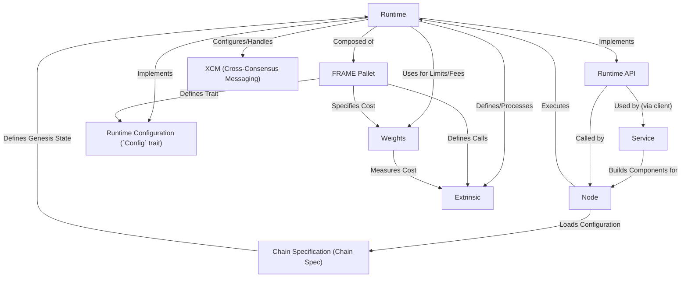

# Tutorial: parachain

This project is a template for creating a **parachain**, which is a specialized blockchain designed to connect to the *Polkadot* or *Kusama* relay chains.
It provides the basic structure for both the **Node** (the software application running the chain) and the **Runtime** (the core logic or "state transition function" defining the chain's rules).
The *Runtime* is built using modular components called **FRAME Pallets**, and it includes features like **XCM** for cross-chain communication and **Weights** for measuring computational costs.

**Source Repository:** [https://github.com/paritytech/polkadot-sdk/tree/master/templates/parachain](https://github.com/paritytech/polkadot-sdk/tree/master/templates/parachain)

## Chapters

1. [Runtime
](01_runtime_.md)
2. [Node
](02_node_.md)
3. [FRAME Pallet
](03_frame_pallet_.md)
4. [Runtime Configuration (`Config` trait)
](04_runtime_configuration___config__trait__.md)
5. [Extrinsic
](05_extrinsic_.md)
6. [Weights
](06_weights_.md)
7. [Chain Specification (Chain Spec)
](07_chain_specification__chain_spec__.md)
8. [Runtime API
](08_runtime_api_.md)
9. [Service
](09_service_.md)
10. [XCM (Cross-Consensus Messaging)
](10_xcm__cross_consensus_messaging__.md)

---

Generated by [AI Codebase Knowledge Builder](https://github.com/The-Pocket/Tutorial-Codebase-Knowledge)